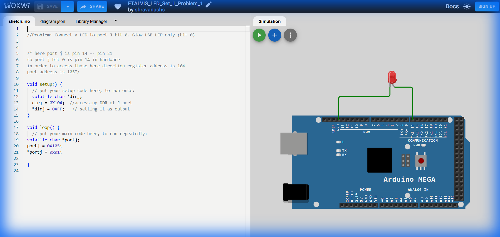

# Set 1 Problem 1: Single LED Blink (Port J)

## Problem Statement
Connect a single LED to **Port J** at **Bit 0** (Pin 14 on the board) and make it blink ON and OFF.

## Simple Explanation
Think of the microcontroller ports as banks of light switches. **Port J** is one such bank with 8 switches (numbered 0 to 7).
-   To turn on the light at position 0, we need to flip switch #0 to "ON".
-   Computers use 0s and 1s. Sending a `1` means ON (5V), and `0` means OFF (0V).
-   We will turn the LED ON, wait for a second, turn it OFF, and wait again.

## Hardware Setup
-   **Port Used**: Port J
-   **Pin**: Bit 0 (Physical Pin 15 on Mega, Digital Pin 14 in Arduino mapped) - *Note: On pure ATmega2560, Port J0 is Pin 63.*
-   **Registers**:
    -   `DDRJ` (Data Direction Register J): Sets pin direction (Input vs Output). Address `0x104`.
    -   `PORTJ` (Port J Data Register): Sets pin state (High vs Low). Address `0x105`.

## Code Analysis

```c
#include <stdint.h>

// --- Register Definitions ---
// We define "pointers" to the specific memory addresses for Port J.
// 'volatile' ensures the compiler always checks the real hardware address.
#define PORTJ (*(volatile uint8_t*)0x105) // Address of PORTJ
#define DDRJ  (*(volatile uint8_t*)0x104) // Address of DDRJ

void setup() {
  // CONFIGURATION
  // We set ALL pins of Port J to OUTPUT mode.
  // 0xFF in Hex is 11111111 in Binary.
  DDRJ = 0xFF;   
}

// A simple delay function to create a visible pause
void delay_ms(void){
  volatile uint32_t i;
  for(i = 0; i < 400000; i++); // Empty loop for delay
}

void loop() {
  // 1. Turn LED ON
  // 0x01 in Hex is 00000001 in Binary.
  // This sets Bit 0 High, turning on the connected LED.
  PORTJ = 0x01;
  delay_ms();

  // 2. Turn LED OFF
  // 0x00 in Hex is 00000000 in Binary.
  // This turns off all pins on Port J.
  PORTJ = 0x00;
  delay_ms();
}
```

## What I Learnt
-   **Register Macros**: Using `#define PORTJ ...` makes code much cleaner than manually typing addresses like `*(volatile char*)0x105` inside functions.
-   **Hexadecimal Basics**: `0x01` represents binary `00000001`, targeting the first bit (Bit 0).
-   **Blinking Logic**: A loop of ON -> Wait -> OFF -> Wait is the fundamental "Hello World" of electronics.

## Circuit Diagram (JSON Schematic)

```json
{
  "version": 1,
  "author": "ShravanaHS",
  "editor": "wokwi",
  "parts": [
    { "type": "wokwi-arduino-mega", "id": "mega", "top": 0, "left": 0, "attrs": {} },
    { "type": "wokwi-resistor", "id": "r1", "top": 150, "left": 220, "attrs": { "value": "220" } },
    { "type": "wokwi-led", "id": "led1", "top": 150, "left": 310, "attrs": { "color": "red" } }
  ],
  "connections": [
    [ "mega:14", "r1:1", "green", [] ],
    [ "r1:2", "led1:A", "green", [] ],
    [ "led1:K", "mega:GND.1", "black", [] ]
  ]
}
```

> **Pin Mapping**: Arduino MEGA Digital Pin 14 = Port J, Bit 0. LED anode → 220Ω resistor → Pin 14. LED cathode → GND.

## Visuals

[Click here to run the simulation on Wokwi](https://wokwi.com/projects/450218684197143553)
