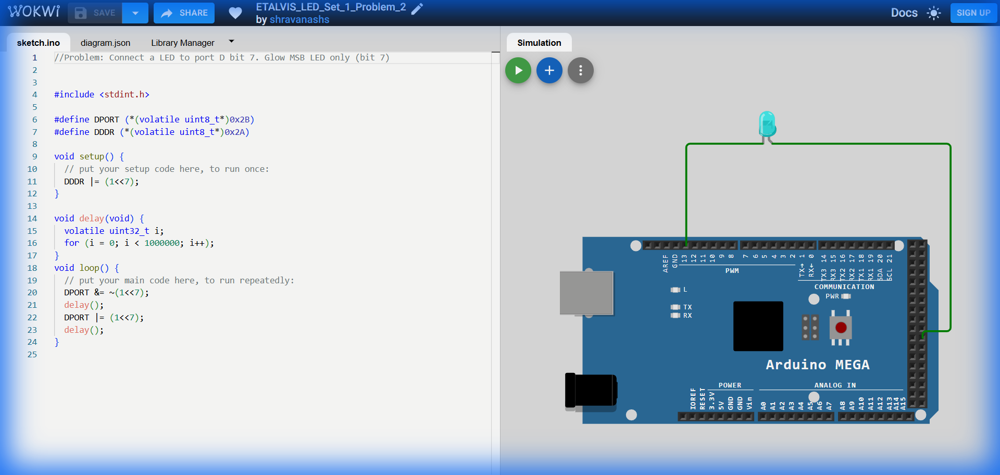

# Set 1 Problem 2: Single LED Blink (Port D)

## Problem Statement
Connect a single LED to **Port D** at **Bit 7** (the last bit, often the Most Significant Bit) and make it blink ON and OFF.

## Simple Explanation
This is similar to Problem 1, but we are using **Port D** and the **7th switch** (Bit 7).
-   Bit 7 is the leftmost bit in a byte: `10000000`.
-   We need to be careful not to disturb the other 7 switches (Bits 0-6) if they were doing something else. We use "Bitwise Operations" for this precision.

## Hardware Setup
-   **Port Used**: Port D
-   **Pin**: Bit 7 (Physical Pin 38 on Mega).
-   **Registers**:
    -   `DDRD` (Data Direction Register D): Address `0x2A`.
    -   `PORTD` (Port D Data Register): Address `0x2B`.

## Code Analysis

```c
#include <stdint.h>

// --- Register Definitions ---
// defining the hardware registers for Port D
#define PORTD (*(volatile uint8_t*)0x2B)
#define DDRD  (*(volatile uint8_t*)0x2A)

void setup() {
  // SETTING DIRECTION
  // We want to set ONLY Bit 7 to Output.
  // (1 << 7) creates the binary value 10000000.
  // The '|=' (OR) operator combines this with the existing value, ensuring
  // we don't accidentally change bits 0-6.
  DDRD |= (1 << 7); 
}

void delay_ms(void) {
  volatile uint32_t i;
  for (i = 0; i < 400000; i++);
}

void loop() {
  // 1. Turn ON (Set Bit 7)
  // We use the OR operator (|) to turn a bit ON.
  // PORTD: xxxxxxxx | 10000000 -> 1xxxxxxx
  PORTD |= (1 << 7);
  delay_ms();

  // 2. Turn OFF (Clear Bit 7)
  // We use the AND operator (&) with the inverse (~) to turn a bit OFF.
  // ~(1 << 7) is 01111111.
  // PORTD: 1xxxxxxx & 01111111 -> 0xxxxxxx
  PORTD &= ~(1 << 7);
  delay_ms();
}
```

## What I Learnt
-   **Bit Shifting (`1 << 7`)**: A clearer way to generate the mask `0x80` (`10000000`). It effectively targets "Bit 7".
-   **Read-Modify-Write**: Using `|=` and `&=` allows us to change *just one bit* without overwriting the entire byte. This is crucial when other pins on the same port are connected to other devices.
-   **Standard Naming**: naming macros `PORTD` and `DDRD` matches the official datasheet conventions.

## Visuals

[Click here to run the simulation on Wokwi](https://wokwi.com/projects/450221318023254017)
