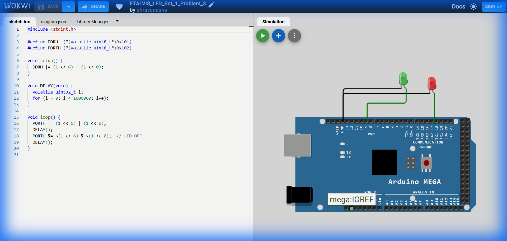

# Set 1 Problem 3: Two LED Blink (Port H)

## Problem Statement
Connect two LEDs to **Port H**:
-   One LED at **Bit 6** (Pin 9).
-   One LED at **Bit 0** (Pin 16 on Mega).
Make them blink together (ON at the same time, OFF at the same time).

## Simple Explanation
We are plugging two LEDs into our "power bank" (Port H) at different sockets (#6 and #0).
-   We want to control them simultaneously.
-   Binary Pattern: `01000001` (Hex `0x41`).

## Hardware Setup
-   **Port Used**: Port H
-   **Pins**: Bit 6 and Bit 0.
-   **Registers**:
    -   `DDRH` (Data Direction Register H): Address `0x101`.
    -   `PORTH` (Port H Data Register): Address `0x102`.

## Code Analysis

```c
#include <stdint.h>

// --- Register Definitions ---
#define PORTH (*(volatile uint8_t*)0x102)
#define DDRH  (*(volatile uint8_t*)0x101)

void setup() {
  // Configure BOTH pins as Outputs at once.
  // (1 << 6) is 01000000
  // (1 << 0) is 00000001
  // Combined (|): 01000001
  DDRH |= (1 << 6) | (1 << 0);
}

void delay_ms(void) {
  volatile uint32_t i;
  for (i = 0; i < 400000; i++);
}

void loop() {
  // 1. Turn ON both LEDs
  // PORTH |= (1 << 6) | (1 << 0);
  PORTH |= (1 << 6) | (1 << 0);    
  delay_ms();

  // 2. Turn OFF both LEDs
  // We use the same bitmask logic to clear them.
  // ~(1<<6) clears bit 6. ~(1<<0) clears bit 0.
  // Combining them clears both.
  PORTH &= ~((1 << 6) | (1 << 0));  
  delay_ms();
}
```

## What I Learnt
-   **Combining Bitmasks**: How to manipulate multiple pins in a single line of code using `|` (OR).
-   **Simultaneous Control**: Bare metal programming allows modifying multiple pins in partially disconnected positions (0 and 6) instantly in one clock cycle.
-   **Operator Precedence**: Using parentheses `~((1<<6) | (1<<0))` ensures we create the full mask `01000001` first, then flip it to `10111110` to clear the bits.

## Visuals

[Click here to run the simulation on Wokwi](https://wokwi.com/projects/450284628790415361)
