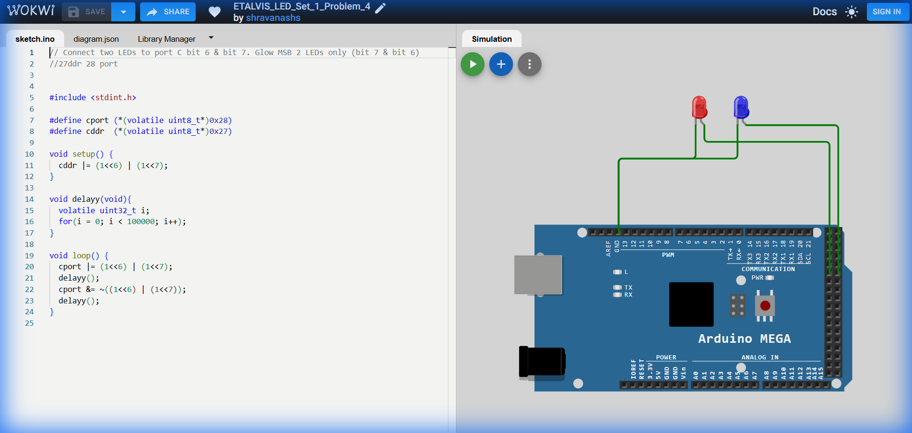

# Set 1 Problem 4: High Bit Blink (Port C)

## Problem Statement
Connect two LEDs to **Port C** at the two highest positions: **Bit 7** and **Bit 6** (Pin 30 and 31).
Blink them on and off.

## Simple Explanation
We are using the last two sockets of the port (the "High" side).
-   Bit 7 (MSB): Worth 128.
-   Bit 6: Worth 64.
-   Together: `11000000` (Hex `0xC0`).

## Hardware Setup
-   **Port Used**: Port C
-   **Pins**: Bit 7 and Bit 6.
-   **Registers**:
    -   `DDRC` (Data Direction Register C): Address `0x27`.
    -   `PORTC` (Port C Data Register): Address `0x28`.

## Code Analysis

```c
#include <stdint.h>

// --- Register Definitions ---
#define PORTC (*(volatile uint8_t*)0x28)
#define DDRC  (*(volatile uint8_t*)0x27)

void setup() {
  // Set Bit 6 and Bit 7 as Output.
  // (1<<6) | (1<<7) creates the mask 11000000.
  DDRC |= (1 << 6) | (1 << 7);
}

void delay_ms(void){
  volatile uint32_t i;
  for(i = 0; i < 400000; i++);
}

void loop() {
  // 1. Turn ON Bit 6 and 7
  PORTC |= (1 << 6) | (1 << 7);
  delay_ms();

  // 2. Turn OFF Bit 6 and 7
  // We compute the mask (11000000), flip it (00111111), and AND it to clear the bits.
  PORTC &= ~((1 << 6) | (1 << 7));
  delay_ms();
}
```

## What I Learnt
-   **Grouping Bits**: Managing adjacent bits (6 and 7) is logically the same as managing disparate bits.
-   **Mask Definitions**: It is often helpful to define a mask, e.g., `#define MASK_HIGH_BITS ((1<<7)|(1<<6))`, to make the main code more readable.
-   **Port C**: Commonly used for LCDs or simple IO on the Mega.

## Visuals

[Click here to run the simulation on Wokwi](https://wokwi.com/projects/450287676924481537)
