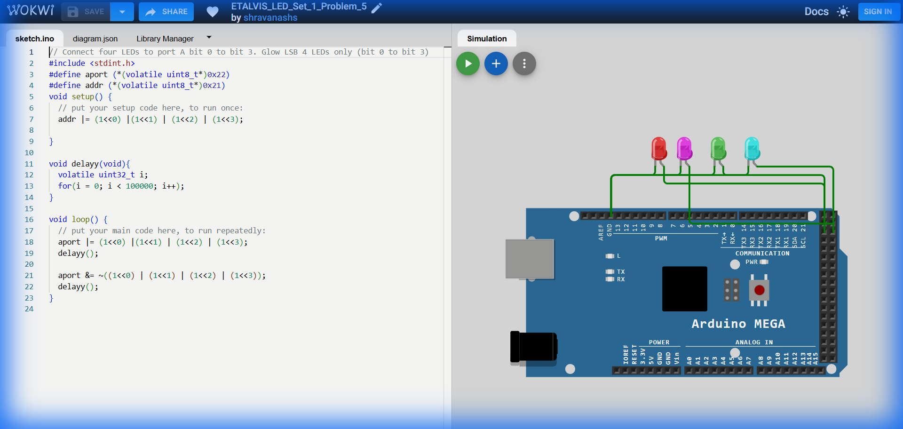

# Set 1 Problem 5: Lower Nibble Blink (Port A)

## Problem Statement
Connect four LEDs to the lower half of **Port A** (Bits 0, 1, 2, 3), representing the "Lower Nibble". Make them blink together.

## Simple Explanation
A "Byte" (8 bits) can be split into two halves called "Nibbles" (4 bits each).
-   **Lower Nibble**: Bits 0, 1, 2, 3 (The right side).
-   **Upper Nibble**: Bits 4, 5, 6, 7 (The left side).
This problem lights up the entire Lower Nibble. Pattern: `00001111` (Hex `0x0F`).

## Hardware Setup
-   **Port Used**: Port A
-   **Pins**: Bits 0-3 (Pins 22-25 on Mega).
-   **Registers**:
    -   `DDRA` (Data Direction Register A): Address `0x21`.
    -   `PORTA` (Port A Data Register): Address `0x22`.

## Code Analysis

```c
#include <stdint.h>

// --- Register Definitions ---
#define PORTA (*(volatile uint8_t*)0x22) // Port A Data
#define DDRA  (*(volatile uint8_t*)0x21)  // Port A Direction

void setup() {
  // Set bits 0, 1, 2, 3 as output.
  // Combines (1<<0) through (1<<3).
  // Resulting Binary: 00001111 (Hex 0x0F).
  DDRA |= (1 << 0) | (1 << 1) | (1 << 2) | (1 << 3);
}

void delay_ms(void){
  volatile uint32_t i;
  for(i = 0; i < 400000; i++);
}

void loop() {
  // 1. Turn ON Lower Nibble
  PORTA |= (1 << 0) | (1 << 1) | (1 << 2) | (1 << 3);
  delay_ms();

  // 2. Turn OFF Lower Nibble
  // ~(00001111) -> 11110000.
  PORTA &= ~((1 << 0) | (1 << 1) | (1 << 2) | (1 << 3));
  delay_ms();
}
```

## What I Learnt
-   **Nibbles**: The concept of splitting a byte into 4-bit chunks.
-   **Hexadecimal Shortcuts**: `0x0F` corresponds exactly to the lower 4 bits being ON. It is often easier to read than `(1<<0)|(1<<1)|...`.
-   **Port Access**: Port A is completely exposed on the Arduino Mega header, making it ideal for 8-bit or 4-bit parallel data (like controlling an LCD).

## Circuit Diagram (JSON Schematic)

```json
{
  "version": 1,
  "author": "ShravanaHS",
  "editor": "wokwi",
  "parts": [
    { "type": "wokwi-arduino-mega", "id": "mega", "top": 0, "left": 0, "attrs": {} },
    { "type": "wokwi-resistor", "id": "r1", "top": 80,  "left": 220, "attrs": { "value": "220" } },
    { "type": "wokwi-led",      "id": "led1", "top": 80,  "left": 310, "attrs": { "color": "red" } },
    { "type": "wokwi-resistor", "id": "r2", "top": 140, "left": 220, "attrs": { "value": "220" } },
    { "type": "wokwi-led",      "id": "led2", "top": 140, "left": 310, "attrs": { "color": "red" } },
    { "type": "wokwi-resistor", "id": "r3", "top": 200, "left": 220, "attrs": { "value": "220" } },
    { "type": "wokwi-led",      "id": "led3", "top": 200, "left": 310, "attrs": { "color": "red" } },
    { "type": "wokwi-resistor", "id": "r4", "top": 260, "left": 220, "attrs": { "value": "220" } },
    { "type": "wokwi-led",      "id": "led4", "top": 260, "left": 310, "attrs": { "color": "red" } }
  ],
  "connections": [
    [ "mega:22", "r1:1", "green", [] ], [ "r1:2", "led1:A", "green", [] ], [ "led1:K", "mega:GND.1", "black", [] ],
    [ "mega:23", "r2:1", "blue",  [] ], [ "r2:2", "led2:A", "blue",  [] ], [ "led2:K", "mega:GND.1", "black", [] ],
    [ "mega:24", "r3:1", "green", [] ], [ "r3:2", "led3:A", "green", [] ], [ "led3:K", "mega:GND.1", "black", [] ],
    [ "mega:25", "r4:1", "blue",  [] ], [ "r4:2", "led4:A", "blue",  [] ], [ "led4:K", "mega:GND.1", "black", [] ]
  ]
}
```

> **Pin Mapping**: Port A Bits 0-3 = Pins 22-25. Each LED connected via 220Ω resistor to respective pin, cathodes to GND.

## Visuals

[Click here to run the simulation on Wokwi](https://wokwi.com/projects/450287693884152833)
