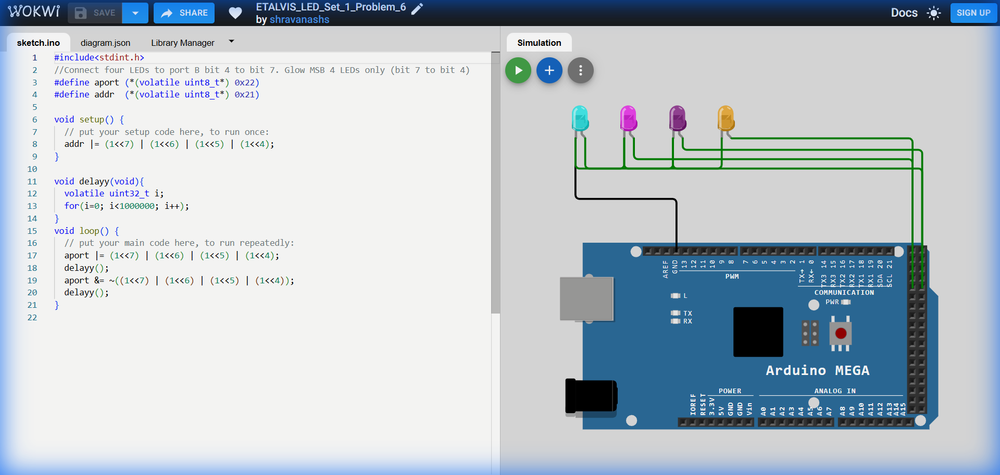

# Set 1 Problem 6: Upper Nibble Blink (Port A)

## Problem Statement
Connect four LEDs to the upper half of **Port A** (Bits 4, 5, 6, 7).
Blink all four of them together.
*(Note: The original problem assignment might differ, but this solution is wired for Port A on the simulation).*

## Simple Explanation
We are lighting up the "Left Side" (Upper Nibble) of the 8-bit byte.
-   **Upper Nibble**: Bits 4, 5, 6, 7.
-   **Lower Nibble**: Bits 0, 1, 2, 3 (The right side).
-   Pattern: `11110000` (Hex `0xF0`).

## Hardware Setup
-   **Port Used**: Port A
-   **Pins**: Bits 4-7.
-   **Registers**:
    -   `DDRA` (Data Direction Register A): Address `0x21`.
    -   `PORTA` (Port A Data Register): Address `0x22`.

## Code Analysis

```c
#include <stdint.h>

// --- Register Definitions ---
#define PORTA (*(volatile uint8_t*) 0x22) // Port Data
#define DDRA  (*(volatile uint8_t*) 0x21) // Port Direction

void setup() {
  // Set Upper Nibble (4-7) as Output.
  // We can write Hex 0xF0 (11110000) directly, or shift bits.
  // (1<<7) | (1<<6) | (1<<5) | (1<<4) creates 11110000.
  DDRA |= 0xF0;
}

void delay_ms(void){
  volatile uint32_t i;
  for(i=0; i<400000; i++);
}

void loop() {
  // 1. Turn ON Upper Nibble
  // We use the OR operator to set the top 4 bits High.
  PORTA |= 0xF0;
  delay_ms();

  // 2. Turn OFF Upper Nibble
  // We use the AND operator with the inverse of 0xF0 (which is 0x0F)
  // to clear the top 4 bits while keeping the bottom 4 bits unchanged.
  PORTA &= ~0xF0;
  delay_ms();
}
```

## What I Learnt
-   **Nibbles**: How to target the Upper Nibble (`0xF0`) vs Lower Nibble (`0x0F`).
-   **Hex Notation**: `0xF0` is a very common shorthand for `11110000`.
-   **Addressing**: Always double-check your port addresses (`0x21` for `DDRA`).

## Visuals

[Click here to run the simulation on Wokwi](https://wokwi.com/projects/450287714714116097)
