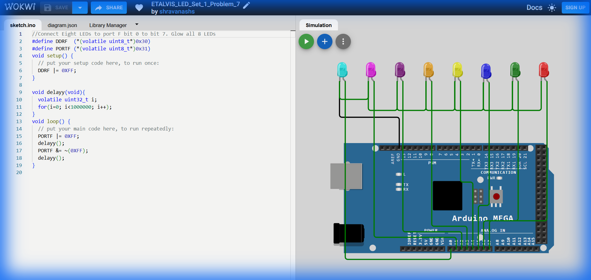

# Set 1 Problem 7: All LEDs Blink (Port F)

## Problem Statement
Connect eight LEDs to the entire **Port F** (Bits 0-7).
Blink all 8 LEDs together.

## Simple Explanation
We are using the entire "power strip". All 8 sockets are active.
-   Turn EVERYTHING ON (`11111111`).
-   Turn EVERYTHING OFF (`00000000`).

## Hardware Setup
-   **Port Used**: Port F
-   **Pins**: Bits 0-7.
-   **Registers**:
    -   `DDRF` (Data Direction Register F): Address `0x30`.
    -   `PORTF` (Port F Data Register): Address `0x31`.

## Code Analysis

```c
#include <stdint.h>

// --- Register Definitions ---
#define DDRF  (*(volatile uint8_t*)0x30)
#define PORTF (*(volatile uint8_t*)0x31)

void setup() {
  // Set all 8 bits to Output.
  // 0xFF is Hex for 255, which is 11111111 in Binary.
  DDRF |= 0xFF;
}

void delay_ms(void){
  volatile uint32_t i;
  for(i=0; i<400000; i++);
}

void loop() {
  // 1. Turn ON all LEDs
  PORTF |= 0xFF;
  delay_ms();

  // 2. Turn OFF all LEDs
  // ~(0xFF) is 0x00 (00000000).
  // This clears all bits on Port F.
  PORTF &= ~0xFF;
  delay_ms();
}
```

## What I Learnt
-   **Hexadecimal `0xFF`**: The shortcut for "All bits ones". This is the standard way to manipulate a full byte.
-   **Port F**: Often used for Analog Inputs on Arduino, but perfectly capable of Digital Output.
-   **Efficiency**: Writing `PORTF = 0xFF` is faster and simpler than setting pins individualy.

## Visuals

[Click here to run the simulation on Wokwi](https://wokwi.com/projects/450287734852019201)
