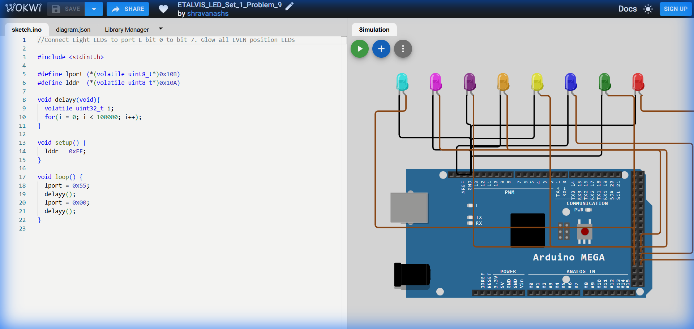

# Set 1 Problem 9: Even LED Blink (Port L)

## Problem Statement
Connect eight LEDs to **Port L**.
Blink only the **Even** position LEDs (Bits 0, 2, 4, 6).

## Simple Explanation
We want to light up every alternate socket starting from the first one.
-   Pattern: 1 (On), 0 (Off), 1 (On), 0 (Off), 1 (On), 0 (Off), 1 (On), 0 (Off).
-   Binary: `01010101` (Hex `0x55`). Note: bit 0 is at the right end.

## Hardware Setup
-   **Port Used**: Port L
-   **Pins**: Even bits (0, 2, 4, 6).
-   **Registers**:
    -   `DDRL` (Data Direction Register L): Address `0x10A`.
    -   `PORTL` (Port L Data Register): Address `0x10B`.

## Code Analysis

```c
#include <stdint.h>

// --- Register Definitions ---
#define PORTL (*(volatile uint8_t*)0x10B)
#define DDRL  (*(volatile uint8_t*)0x10A)

void setup() {
  // Set all pins of Port L to Output mode.
  // Even though we only use the Even pins, setting 0xFF makes all 8 pins outputs.
  DDRL = 0xFF;
}

void delay_ms(void){
  volatile uint32_t i;
  for(i = 0; i < 400000; i++);
}

void loop() {
  // 1. Turn ON Even LEDs
  // 0x55 is the Hex code for 01010101.
  // This lights up bits 0, 2, 4, 6.
  PORTL = 0x55;
  delay_ms();

  // 2. Turn OFF all LEDs
  PORTL = 0x00;
  delay_ms();
}
```

## What I Learnt
-   **Magic Number `0x55`**: Memorizing that `0x55` (`01010101`) is the pattern for "Alternating bits starting with 1 at LSB".
-   **Efficient Port Writing**: We can set the complex pattern in a single instruction (`PORTL = 0x55`) rather than setting 4 different pins individually.
-   **Code Clarity**: Using `0x55` makes the intent (alternating pattern) immediately recognizable to experienced programmers.

## Visuals

[Click here to run the simulation on Wokwi](https://wokwi.com/projects/450288081398026241)
