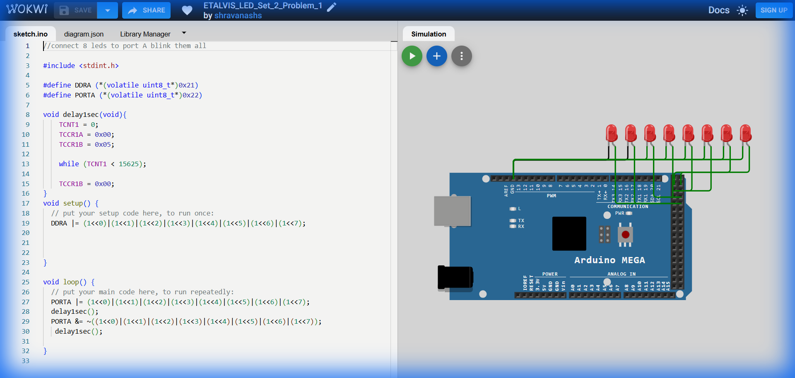

# Set 2 Problem 1: All LEDs Blink with Timer (Port A)

## Problem Statement
Connect 8 LEDs to **Port A** and make them ALL blink together.
The key difference from Set 1 is that we must use a **Hardware Timer** to create a precise 1-second delay, instead of just counting up in a loop.

## Simple Explanation
-   **Goal**: Flash all 8 lights on and off.
-   **Method**: Use an "Alarm Clock" inside the chip (Timer 1) to tell us exactly when 1 second has passed, ensuring our blinking speed is accurate.

## Hardware Setup
-   **Port A**: Address `0x22`.
-   **Registers**:
    -   `DDRA` (`0x21`): Direction.
    -   `PORTA` (`0x22`): Output.

## Code Analysis

```c
#include <stdint.h>

#define DDRA (*(volatile uint8_t*)0x21)
#define PORTA (*(volatile uint8_t*)0x22)

/* 
 * Precise Delay Function using Timer 1
 * 1. Reset the timer count (TCNT1) to 0.
 * 2. Set the speed (Prescaler) to 1024 (TCCR1B = 0x05).
 *    - CPU Speed = 16,000,000 Hz.
 *    - Timer Speed = 16,000,000 / 1024 = 15,625 Hz (Ticks per second).
 * 3. Wait until the counter reaches 15625 (which takes exactly 1 second).
 * 4. Stop the timer.
 */
void delay1sec(void){
    TCNT1 = 0;        
    TCCR1A = 0x00;    
    TCCR1B = 0x05;   

    while (TCNT1 < 15625); 

    TCCR1B = 0x00;   
}

void setup() {
  // Set all 8 bits of Port A to Output.
  // (1<<0) | ... | (1<<7) results in 11111111 (0xFF).
  DDRA |= (1<<0)|(1<<1)|(1<<2)|(1<<3)|(1<<4)|(1<<5)|(1<<6)|(1<<7);
}

void loop() {
  // Turn ON all LEDs
  PORTA |= (1<<0)|(1<<1)|(1<<2)|(1<<3)|(1<<4)|(1<<5)|(1<<6)|(1<<7);
  delay1sec();

  // Turn OFF all LEDs
  PORTA &= ~((1<<0)|(1<<1)|(1<<2)|(1<<3)|(1<<4)|(1<<5)|(1<<6)|(1<<7));
  delay1sec();
}
```

## What I Learnt
-   **Hardware Timers**: How `TCNT1` counts up automatically in the background.
-   **Prescalers**: Slowing down the super-fast CPU clock (16MHz) to a manageable speed for human-visible delays (15.6kHz).
-   **Math**: 16MHz / 1024 = 15625 ticks per second.

## Circuit Diagram (JSON Schematic)

```json
{
  "version": 1,
  "author": "ShravanaHS",
  "editor": "wokwi",
  "parts": [
    { "type": "wokwi-arduino-mega", "id": "mega", "top": 0, "left": 0, "attrs": {} },
    { "type": "wokwi-resistor", "id": "r1", "top": 50,  "left": 220, "attrs": { "value": "220" } },
    { "type": "wokwi-led",      "id": "led1", "top": 50,  "left": 310, "attrs": { "color": "red" } },
    { "type": "wokwi-resistor", "id": "r2", "top": 100, "left": 220, "attrs": { "value": "220" } },
    { "type": "wokwi-led",      "id": "led2", "top": 100, "left": 310, "attrs": { "color": "red" } },
    { "type": "wokwi-resistor", "id": "r3", "top": 150, "left": 220, "attrs": { "value": "220" } },
    { "type": "wokwi-led",      "id": "led3", "top": 150, "left": 310, "attrs": { "color": "red" } },
    { "type": "wokwi-resistor", "id": "r4", "top": 200, "left": 220, "attrs": { "value": "220" } },
    { "type": "wokwi-led",      "id": "led4", "top": 200, "left": 310, "attrs": { "color": "red" } },
    { "type": "wokwi-resistor", "id": "r5", "top": 250, "left": 220, "attrs": { "value": "220" } },
    { "type": "wokwi-led",      "id": "led5", "top": 250, "left": 310, "attrs": { "color": "red" } },
    { "type": "wokwi-resistor", "id": "r6", "top": 300, "left": 220, "attrs": { "value": "220" } },
    { "type": "wokwi-led",      "id": "led6", "top": 300, "left": 310, "attrs": { "color": "red" } },
    { "type": "wokwi-resistor", "id": "r7", "top": 350, "left": 220, "attrs": { "value": "220" } },
    { "type": "wokwi-led",      "id": "led7", "top": 350, "left": 310, "attrs": { "color": "red" } },
    { "type": "wokwi-resistor", "id": "r8", "top": 400, "left": 220, "attrs": { "value": "220" } },
    { "type": "wokwi-led",      "id": "led8", "top": 400, "left": 310, "attrs": { "color": "red" } }
  ],
  "connections": [
    [ "mega:22", "r1:1", "green", [] ], [ "r1:2", "led1:A", "green", [] ], [ "led1:K", "mega:GND.1", "black", [] ],
    [ "mega:23", "r2:1", "blue",  [] ], [ "r2:2", "led2:A", "blue",  [] ], [ "led2:K", "mega:GND.1", "black", [] ],
    [ "mega:24", "r3:1", "green", [] ], [ "r3:2", "led3:A", "green", [] ], [ "led3:K", "mega:GND.1", "black", [] ],
    [ "mega:25", "r4:1", "blue",  [] ], [ "r4:2", "led4:A", "blue",  [] ], [ "led4:K", "mega:GND.1", "black", [] ],
    [ "mega:26", "r5:1", "green", [] ], [ "r5:2", "led5:A", "green", [] ], [ "led5:K", "mega:GND.1", "black", [] ],
    [ "mega:27", "r6:1", "blue",  [] ], [ "r6:2", "led6:A", "blue",  [] ], [ "led6:K", "mega:GND.1", "black", [] ],
    [ "mega:28", "r7:1", "green", [] ], [ "r7:2", "led7:A", "green", [] ], [ "led7:K", "mega:GND.1", "black", [] ],
    [ "mega:29", "r8:1", "blue",  [] ], [ "r8:2", "led8:A", "blue",  [] ], [ "led8:K", "mega:GND.1", "black", [] ]
  ]
}
```

> **Pin Mapping**: Port A Bits 0-7 = MEGA Pins 22-29. Hardware Timer1 used for 1-second precision delay (prescaler 1024).

## Visuals

[Click here to run the simulation on Wokwi](https://wokwi.com/projects/450837212305922049)
