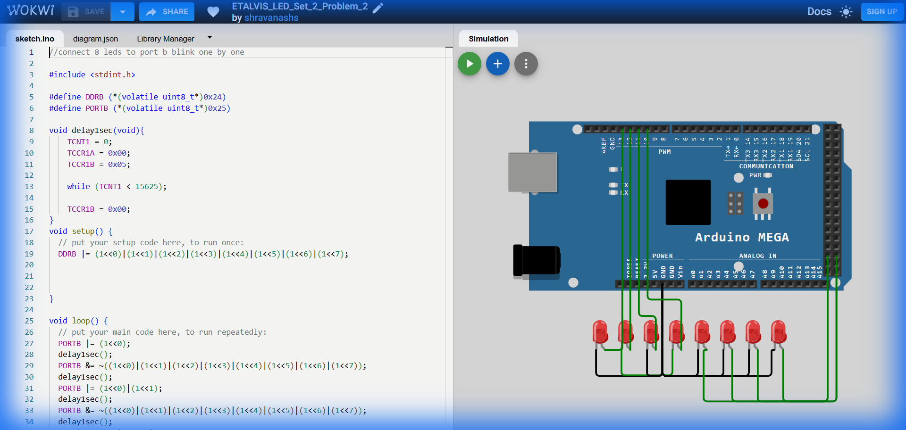

# Set 2 Problem 2: Sequential Accumulate (Port B)

## Problem Statement
Connect 8 LEDs to **Port B**.
Light them up one by one, **keeping the previous ones ON**.
1.  Light 1.
2.  Light 1+2.
3.  Light 1+2+3.
...
At the end, turn everything off and restart.

## Simple Explanation
Imagine you are filling a progress bar. You fill the first block, then the second (while keeping the first), then the third... until the bar is full. Then you clear it.

## Hardware Setup
-   **Port B**: Address `0x25`.
-   **Registers**: `DDRB` (`0x24`), `PORTB` (`0x25`).

## Code Analysis

```c
#include <stdint.h>
#define DDRB (*(volatile uint8_t*)0x24)
#define PORTB (*(volatile uint8_t*)0x25)

void delay1sec(void){
    TCNT1 = 0; TCCR1A = 0x00; TCCR1B = 0x05;
    while (TCNT1 < 15625);
    TCCR1B = 0x00;
}

void setup() {
  DDRB |= 0xFF; // All Output
}

void loop() {
  // Step 1: Turn ON Bit 0
  PORTB |= (1<<0);
  delay1sec();
  // Turn OFF everything? 
  // WAIT! The code in the problem actually turns them OFF after every step!
  // Let's analyze carefully:
  // "PORTB &= ~((1<<0)...)" clears ALL bits.
  // So the actual behavior of this provided code is: Blink Bit 0 -> Blink Bits 0+1 -> Blink Bits 0+1+2.
  // It is a "Growing Blink".
  
  PORTB &= ~((1<<0)|(1<<1)|...|(1<<7)); // Turn ALL off
  delay1sec();
  
  // Step 2: Turn ON Bits 0 + 1
  PORTB |= (1<<0)|(1<<1);
  delay1sec();
  PORTB &= ~0xFF; // Clear
  delay1sec();

  // ... (Repeats for larger groups) ...

  // Step 8: Turn ON Bits 0..7
  PORTB |= 0xFF;
  delay1sec();
  PORTB &= ~0xFF;
  delay1sec();
}
```

## What I Learnt
-   **Manual Sequencing**: Writing out every single step explicitly (Linear Code) vs using Loops.
-   **Cumulative Masks**: How `(1<<0) | (1<<1)` combines two separate pins.

## Circuit Diagram (JSON Schematic)

```json
{
  "version": 1,
  "author": "ShravanaHS",
  "editor": "wokwi",
  "parts": [
    { "type": "wokwi-arduino-mega", "id": "mega", "top": 0, "left": 0, "attrs": {} },
    { "type": "wokwi-resistor", "id": "r1", "top": 50,  "left": 220, "attrs": { "value": "220" } },
    { "type": "wokwi-led",      "id": "led1", "top": 50,  "left": 310, "attrs": { "color": "red" } },
    { "type": "wokwi-resistor", "id": "r2", "top": 100, "left": 220, "attrs": { "value": "220" } },
    { "type": "wokwi-led",      "id": "led2", "top": 100, "left": 310, "attrs": { "color": "red" } },
    { "type": "wokwi-resistor", "id": "r3", "top": 150, "left": 220, "attrs": { "value": "220" } },
    { "type": "wokwi-led",      "id": "led3", "top": 150, "left": 310, "attrs": { "color": "red" } },
    { "type": "wokwi-resistor", "id": "r4", "top": 200, "left": 220, "attrs": { "value": "220" } },
    { "type": "wokwi-led",      "id": "led4", "top": 200, "left": 310, "attrs": { "color": "red" } },
    { "type": "wokwi-resistor", "id": "r5", "top": 250, "left": 220, "attrs": { "value": "220" } },
    { "type": "wokwi-led",      "id": "led5", "top": 250, "left": 310, "attrs": { "color": "red" } },
    { "type": "wokwi-resistor", "id": "r6", "top": 300, "left": 220, "attrs": { "value": "220" } },
    { "type": "wokwi-led",      "id": "led6", "top": 300, "left": 310, "attrs": { "color": "red" } },
    { "type": "wokwi-resistor", "id": "r7", "top": 350, "left": 220, "attrs": { "value": "220" } },
    { "type": "wokwi-led",      "id": "led7", "top": 350, "left": 310, "attrs": { "color": "red" } },
    { "type": "wokwi-resistor", "id": "r8", "top": 400, "left": 220, "attrs": { "value": "220" } },
    { "type": "wokwi-led",      "id": "led8", "top": 400, "left": 310, "attrs": { "color": "red" } }
  ],
  "connections": [
    [ "mega:53", "r1:1", "green", [] ], [ "r1:2", "led1:A", "green", [] ], [ "led1:K", "mega:GND.1", "black", [] ],
    [ "mega:52", "r2:1", "blue",  [] ], [ "r2:2", "led2:A", "blue",  [] ], [ "led2:K", "mega:GND.1", "black", [] ],
    [ "mega:51", "r3:1", "green", [] ], [ "r3:2", "led3:A", "green", [] ], [ "led3:K", "mega:GND.1", "black", [] ],
    [ "mega:50", "r4:1", "blue",  [] ], [ "r4:2", "led4:A", "blue",  [] ], [ "led4:K", "mega:GND.1", "black", [] ],
    [ "mega:10", "r5:1", "green", [] ], [ "r5:2", "led5:A", "green", [] ], [ "led5:K", "mega:GND.1", "black", [] ],
    [ "mega:11", "r6:1", "blue",  [] ], [ "r6:2", "led6:A", "blue",  [] ], [ "led6:K", "mega:GND.1", "black", [] ],
    [ "mega:12", "r7:1", "green", [] ], [ "r7:2", "led7:A", "green", [] ], [ "led7:K", "mega:GND.1", "black", [] ],
    [ "mega:13", "r8:1", "blue",  [] ], [ "r8:2", "led8:A", "blue",  [] ], [ "led8:K", "mega:GND.1", "black", [] ]
  ]
}
```

> **Pin Mapping**: Port B Bits 0-7 = MEGA Pins 53,52,51,50,10,11,12,13 (PB0=Pin53, PB1=Pin52, PB2=Pin51, PB3=Pin50, PB4=Pin10, PB5=Pin11, PB6=Pin12, PB7=Pin13).

## Visuals

[Click here to run the simulation on Wokwi](https://wokwi.com/projects/450839093411595265)
