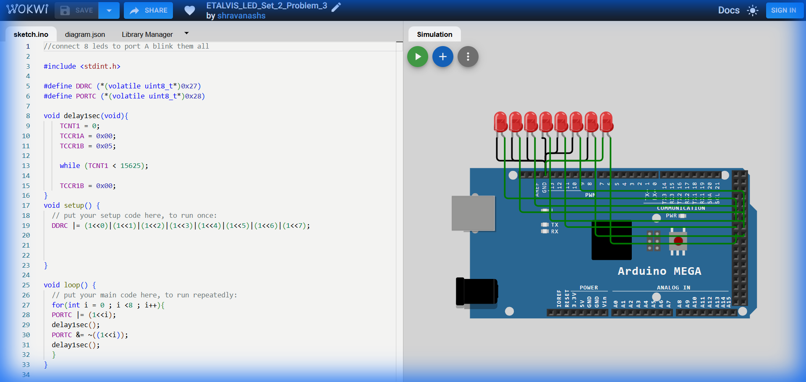

# Set 2 Problem 3: Sequential Single Blink (Port C)

## Problem Statement
Connect 8 LEDs to **Port C**.
Blink them one at a time in order: LED 0, then LED 1, then LED 2... up to LED 7.
Only ONE LED should be on at a time.

## Simple Explanation
This is the classic "Knight Rider" or "Scanner" effect (in one direction). The light moves from one end to the other.

## Hardware Setup
-   **Port C**: Address `0x28`.
-   **Registers**: `DDRC` (`0x27`), `PORTC` (`0x28`).

## Code Analysis

```c
#include <stdint.h>
#define DDRC (*(volatile uint8_t*)0x27)
#define PORTC (*(volatile uint8_t*)0x28)

void delay1sec(void){
    TCNT1 = 0; TCCR1A = 0x00; TCCR1B = 0x05;
    while (TCNT1 < 15625);
    TCCR1B = 0x00;
}

void setup() {
  // Set all pins to Output
  DDRC |= 0xFF;
}

void loop() {
  // Using a FOR Loop to automate the sequence
  for(int i = 0 ; i < 8 ; i++){
    
    // 1. Turn ON the current LED (i)
    // '|=' adds this light to whatever is there (though usually others are off)
    PORTC |= (1<<i);
    delay1sec();
    
    // 2. Turn OFF the current LED (i)
    // '&=' with '~' removes just this light.
    PORTC &= ~((1<<i));
    delay1sec();
  }
}
```

## What I Learnt
-   **Loops**: Using `for (i=0; i<8)` replaces writing 8 blocks of identical code.
-   **Variable Shift**: Using `(1 << i)` allows us to target a different pin dynamically in each iteration of the loop.

## Circuit Diagram (JSON Schematic)

```json
{
  "version": 1,
  "author": "ShravanaHS",
  "editor": "wokwi",
  "parts": [
    { "type": "wokwi-arduino-mega", "id": "mega", "top": 0, "left": 0, "attrs": {} },
    { "type": "wokwi-resistor", "id": "r1", "top": 50,  "left": 220, "attrs": { "value": "220" } },
    { "type": "wokwi-led",      "id": "led1", "top": 50,  "left": 310, "attrs": { "color": "red" } },
    { "type": "wokwi-resistor", "id": "r2", "top": 100, "left": 220, "attrs": { "value": "220" } },
    { "type": "wokwi-led",      "id": "led2", "top": 100, "left": 310, "attrs": { "color": "red" } },
    { "type": "wokwi-resistor", "id": "r3", "top": 150, "left": 220, "attrs": { "value": "220" } },
    { "type": "wokwi-led",      "id": "led3", "top": 150, "left": 310, "attrs": { "color": "red" } },
    { "type": "wokwi-resistor", "id": "r4", "top": 200, "left": 220, "attrs": { "value": "220" } },
    { "type": "wokwi-led",      "id": "led4", "top": 200, "left": 310, "attrs": { "color": "red" } },
    { "type": "wokwi-resistor", "id": "r5", "top": 250, "left": 220, "attrs": { "value": "220" } },
    { "type": "wokwi-led",      "id": "led5", "top": 250, "left": 310, "attrs": { "color": "red" } },
    { "type": "wokwi-resistor", "id": "r6", "top": 300, "left": 220, "attrs": { "value": "220" } },
    { "type": "wokwi-led",      "id": "led6", "top": 300, "left": 310, "attrs": { "color": "red" } },
    { "type": "wokwi-resistor", "id": "r7", "top": 350, "left": 220, "attrs": { "value": "220" } },
    { "type": "wokwi-led",      "id": "led7", "top": 350, "left": 310, "attrs": { "color": "red" } },
    { "type": "wokwi-resistor", "id": "r8", "top": 400, "left": 220, "attrs": { "value": "220" } },
    { "type": "wokwi-led",      "id": "led8", "top": 400, "left": 310, "attrs": { "color": "red" } }
  ],
  "connections": [
    [ "mega:37", "r1:1", "green", [] ], [ "r1:2", "led1:A", "green", [] ], [ "led1:K", "mega:GND.1", "black", [] ],
    [ "mega:36", "r2:1", "blue",  [] ], [ "r2:2", "led2:A", "blue",  [] ], [ "led2:K", "mega:GND.1", "black", [] ],
    [ "mega:35", "r3:1", "green", [] ], [ "r3:2", "led3:A", "green", [] ], [ "led3:K", "mega:GND.1", "black", [] ],
    [ "mega:34", "r4:1", "blue",  [] ], [ "r4:2", "led4:A", "blue",  [] ], [ "led4:K", "mega:GND.1", "black", [] ],
    [ "mega:33", "r5:1", "green", [] ], [ "r5:2", "led5:A", "green", [] ], [ "led5:K", "mega:GND.1", "black", [] ],
    [ "mega:32", "r6:1", "blue",  [] ], [ "r6:2", "led6:A", "blue",  [] ], [ "led6:K", "mega:GND.1", "black", [] ],
    [ "mega:31", "r7:1", "green", [] ], [ "r7:2", "led7:A", "green", [] ], [ "led7:K", "mega:GND.1", "black", [] ],
    [ "mega:30", "r8:1", "blue",  [] ], [ "r8:2", "led8:A", "blue",  [] ], [ "led8:K", "mega:GND.1", "black", [] ]
  ]
}
```

> **Pin Mapping**: Port C Bits 0-7 = MEGA Pins 37-30 (PC0=Pin37, PC1=Pin36, ..., PC7=Pin30). Knight Rider sequential blink.

## Visuals

[Click here to run the simulation on Wokwi](https://wokwi.com/projects/450840620058693633)
