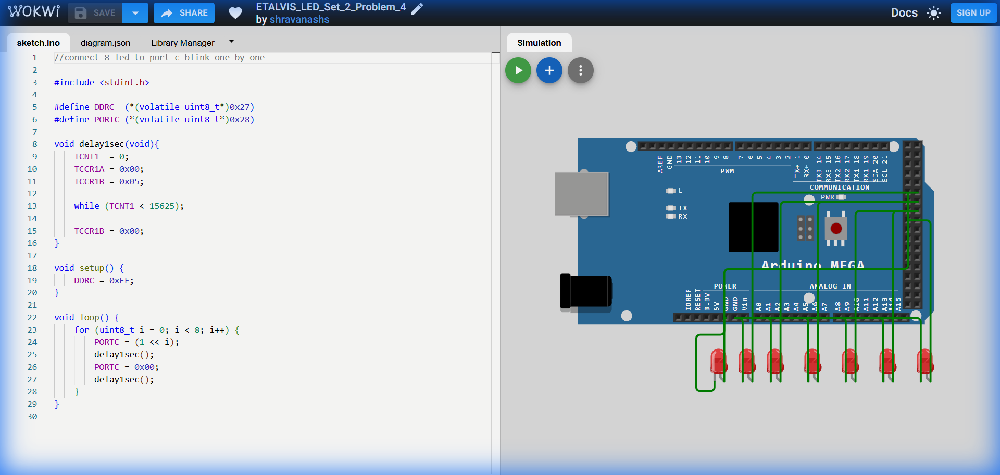

# Set 2 Problem 4: Single Blink with Total Clear (Port C)

## Problem Statement
Connect 8 LEDs to **Port C**.
Blink them one by one (0 to 7).
**Difference from Problem 3**: In Problem 3, we turned off the specific bit using `&= ~`. Here, we turn off *everything* using `= 0x00`.

## Simple Explanation
1.  Turn On Light X. Wait.
2.  Turn Off EVERYTHING. Wait.
3.  Turn On Light X+1. Wait.
4.  Turn Off EVERYTHING. Wait.

## Hardware Setup
-   **Port C**: Address `0x28`.

## Code Analysis

```c
#include <stdint.h>
#define DDRC  (*(volatile uint8_t*)0x27)
#define PORTC (*(volatile uint8_t*)0x28)

// Precise 1-second delay
void delay1sec(void){
    TCNT1  = 0; TCCR1A = 0x00; TCCR1B = 0x05;          
    while (TCNT1 < 15625);
    TCCR1B = 0x00;          
}

void setup() {
    DDRC = 0xFF;            
}

void loop() {
    for (uint8_t i = 0; i < 8; i++) {
        // 1. Turn ON ONLY the current LED
        // Using '=' (Assignment) instead of '|=' (OR).
        // This sets 'i' to 1 and FORCES all others to 0 immediately.
        PORTC = (1 << i);   
        delay1sec();
        
        // 2. Turn OFF everything
        PORTC = 0x00;       
        delay1sec();
    }
}
```

## What I Learnt
-   **Assignment (`=`) vs OR (`|=`)**:
    -   `PORTC = (1<<i)`: "Make Port C look exactly like this pattern (only bit i is ON)." Safe if you own the whole port.
    -   `PORTC |= (1<<i)`: "Turn on bit i, leave others alone." Safer if other pins serve different purposes.
-   **Simplification**: Clearing with `0x00` is simpler than calculating individual bitmasks if you know you want everything off.

## Circuit Diagram (JSON Schematic)

```json
{
  "version": 1,
  "author": "ShravanaHS",
  "editor": "wokwi",
  "parts": [
    { "type": "wokwi-arduino-mega", "id": "mega", "top": 0, "left": 0, "attrs": {} },
    { "type": "wokwi-resistor", "id": "r1", "top": 50,  "left": 220, "attrs": { "value": "220" } },
    { "type": "wokwi-led",      "id": "led1", "top": 50,  "left": 310, "attrs": { "color": "red" } },
    { "type": "wokwi-resistor", "id": "r2", "top": 100, "left": 220, "attrs": { "value": "220" } },
    { "type": "wokwi-led",      "id": "led2", "top": 100, "left": 310, "attrs": { "color": "red" } },
    { "type": "wokwi-resistor", "id": "r3", "top": 150, "left": 220, "attrs": { "value": "220" } },
    { "type": "wokwi-led",      "id": "led3", "top": 150, "left": 310, "attrs": { "color": "red" } },
    { "type": "wokwi-resistor", "id": "r4", "top": 200, "left": 220, "attrs": { "value": "220" } },
    { "type": "wokwi-led",      "id": "led4", "top": 200, "left": 310, "attrs": { "color": "red" } },
    { "type": "wokwi-resistor", "id": "r5", "top": 250, "left": 220, "attrs": { "value": "220" } },
    { "type": "wokwi-led",      "id": "led5", "top": 250, "left": 310, "attrs": { "color": "red" } },
    { "type": "wokwi-resistor", "id": "r6", "top": 300, "left": 220, "attrs": { "value": "220" } },
    { "type": "wokwi-led",      "id": "led6", "top": 300, "left": 310, "attrs": { "color": "red" } },
    { "type": "wokwi-resistor", "id": "r7", "top": 350, "left": 220, "attrs": { "value": "220" } },
    { "type": "wokwi-led",      "id": "led7", "top": 350, "left": 310, "attrs": { "color": "red" } },
    { "type": "wokwi-resistor", "id": "r8", "top": 400, "left": 220, "attrs": { "value": "220" } },
    { "type": "wokwi-led",      "id": "led8", "top": 400, "left": 310, "attrs": { "color": "red" } }
  ],
  "connections": [
    [ "mega:37", "r1:1", "green", [] ], [ "r1:2", "led1:A", "green", [] ], [ "led1:K", "mega:GND.1", "black", [] ],
    [ "mega:36", "r2:1", "blue",  [] ], [ "r2:2", "led2:A", "blue",  [] ], [ "led2:K", "mega:GND.1", "black", [] ],
    [ "mega:35", "r3:1", "green", [] ], [ "r3:2", "led3:A", "green", [] ], [ "led3:K", "mega:GND.1", "black", [] ],
    [ "mega:34", "r4:1", "blue",  [] ], [ "r4:2", "led4:A", "blue",  [] ], [ "led4:K", "mega:GND.1", "black", [] ],
    [ "mega:33", "r5:1", "green", [] ], [ "r5:2", "led5:A", "green", [] ], [ "led5:K", "mega:GND.1", "black", [] ],
    [ "mega:32", "r6:1", "blue",  [] ], [ "r6:2", "led6:A", "blue",  [] ], [ "led6:K", "mega:GND.1", "black", [] ],
    [ "mega:31", "r7:1", "green", [] ], [ "r7:2", "led7:A", "green", [] ], [ "led7:K", "mega:GND.1", "black", [] ],
    [ "mega:30", "r8:1", "blue",  [] ], [ "r8:2", "led8:A", "blue",  [] ], [ "led8:K", "mega:GND.1", "black", [] ]
  ]
}
```

> **Pin Mapping**: Port C Bits 0-7 = MEGA Pins 37-30. Uses total clear (PORTC=0x00) between each LED blink.

## Visuals

[Click here to run the simulation on Wokwi](https://wokwi.com/projects/451214774943659009)
