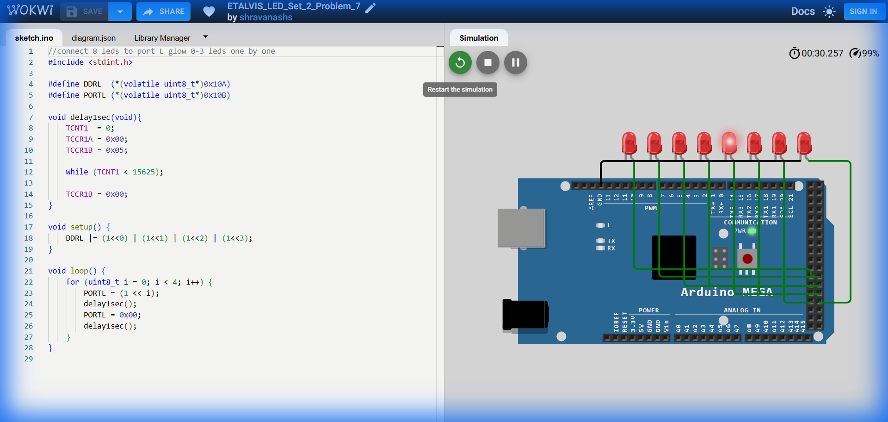

# Set 2 Problem 7: Lower Nibble Blink (Port L)

## Problem Statement
Connect 8 LEDs to **Port L**.
Blink the first four LEDs (0 to 3) one by one in order.
Ignore the rest (4 to 7).

## Simple Explanation
We are scanning through the "Lower Half" of the port.
1. Light 0 (Off).
2. Light 1 (Off).
3. Light 2 (Off).
4. Light 3 (Off).
Stop and Repeat.

## Hardware Setup
-   **Port L**: Address `0x10B`.
-   **Bits**: 0, 1, 2, 3.

## Code Analysis

```c
#include <stdint.h>
#define DDRL (*(volatile uint8_t*)0x10A)
#define PORTL (*(volatile uint8_t*)0x10B)

void delay1sec(void){
  TCNT1 = 0; TCCR1A = 0x00; TCCR1B = 0x05;
  while (TCNT1 < 15625);
  TCCR1B = 0x00;
}

void setup() {
  // Set Bits 0, 1, 2, 3 as Output.
  // (1<<0) | (1<<1) | (1<<2) | (1<<3) = 00001111 (0x0F)
  DDRL |= (1<<0) | (1<<1) | (1<<2) | (1<<3);
}

void loop() {
  // Loop from index 0 to 3
  for (uint8_t i = 0; i < 4; i++) {
    // Turn On
    PORTL = (1 << i);
    delay1sec();
    // Turn Off
    PORTL = 0x00;
    delay1sec();
  }
}
```

## What I Learnt
-   **Partial Scanning**: Restricting a loop `i < 4` allows us to animate just a specific section of the LED strip, leaving the others dark (or available for other tasks if we used `|=`).

## Circuit Diagram (JSON Schematic)

```json
{
  "version": 1,
  "author": "ShravanaHS",
  "editor": "wokwi",
  "parts": [
    { "type": "wokwi-arduino-mega", "id": "mega", "top": 0, "left": 0, "attrs": {} },
    { "type": "wokwi-resistor", "id": "r1", "top": 50,  "left": 220, "attrs": { "value": "220" } },
    { "type": "wokwi-led",      "id": "led1", "top": 50,  "left": 310, "attrs": { "color": "red" } },
    { "type": "wokwi-resistor", "id": "r2", "top": 100, "left": 220, "attrs": { "value": "220" } },
    { "type": "wokwi-led",      "id": "led2", "top": 100, "left": 310, "attrs": { "color": "red" } },
    { "type": "wokwi-resistor", "id": "r3", "top": 150, "left": 220, "attrs": { "value": "220" } },
    { "type": "wokwi-led",      "id": "led3", "top": 150, "left": 310, "attrs": { "color": "red" } },
    { "type": "wokwi-resistor", "id": "r4", "top": 200, "left": 220, "attrs": { "value": "220" } },
    { "type": "wokwi-led",      "id": "led4", "top": 200, "left": 310, "attrs": { "color": "red" } },
    { "type": "wokwi-resistor", "id": "r5", "top": 250, "left": 220, "attrs": { "value": "220" } },
    { "type": "wokwi-led",      "id": "led5", "top": 250, "left": 310, "attrs": { "color": "gray" } },
    { "type": "wokwi-resistor", "id": "r6", "top": 300, "left": 220, "attrs": { "value": "220" } },
    { "type": "wokwi-led",      "id": "led6", "top": 300, "left": 310, "attrs": { "color": "gray" } },
    { "type": "wokwi-resistor", "id": "r7", "top": 350, "left": 220, "attrs": { "value": "220" } },
    { "type": "wokwi-led",      "id": "led7", "top": 350, "left": 310, "attrs": { "color": "gray" } },
    { "type": "wokwi-resistor", "id": "r8", "top": 400, "left": 220, "attrs": { "value": "220" } },
    { "type": "wokwi-led",      "id": "led8", "top": 400, "left": 310, "attrs": { "color": "gray" } }
  ],
  "connections": [
    [ "mega:49", "r1:1", "green", [] ], [ "r1:2", "led1:A", "green", [] ], [ "led1:K", "mega:GND.1", "black", [] ],
    [ "mega:48", "r2:1", "blue",  [] ], [ "r2:2", "led2:A", "blue",  [] ], [ "led2:K", "mega:GND.1", "black", [] ],
    [ "mega:47", "r3:1", "green", [] ], [ "r3:2", "led3:A", "green", [] ], [ "led3:K", "mega:GND.1", "black", [] ],
    [ "mega:46", "r4:1", "blue",  [] ], [ "r4:2", "led4:A", "blue",  [] ], [ "led4:K", "mega:GND.1", "black", [] ],
    [ "mega:45", "r5:1", "gray",  [] ], [ "r5:2", "led5:A", "gray",  [] ], [ "led5:K", "mega:GND.1", "black", [] ],
    [ "mega:44", "r6:1", "gray",  [] ], [ "r6:2", "led6:A", "gray",  [] ], [ "led6:K", "mega:GND.1", "black", [] ],
    [ "mega:43", "r7:1", "gray",  [] ], [ "r7:2", "led7:A", "gray",  [] ], [ "led7:K", "mega:GND.1", "black", [] ],
    [ "mega:42", "r8:1", "gray",  [] ], [ "r8:2", "led8:A", "gray",  [] ], [ "led8:K", "mega:GND.1", "black", [] ]
  ]
}
```

> **Pin Mapping**: Port L Bits 0-7 = MEGA Pins 49-42. Only Bits 0-3 (Pins 49-46) are used in the lower nibble blink sequence.

## Visuals

[Click here to run the simulation on Wokwi](https://wokwi.com/projects/450854181787164673)
