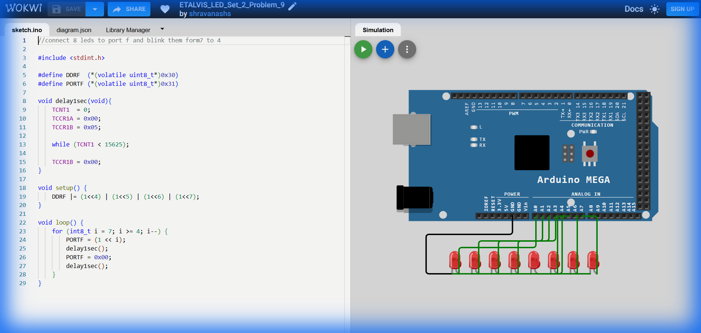

# Set 2 Problem 9: Reverse Upper Nibble Blink (Port F)

## Problem Statement
Connect 8 LEDs to **Port F**.
Blink the upper LEDs (7, 6, 5, 4) in **Reverse Order**.

## Simple Explanation
This is the same as Problem 8, but backwards.
Start at the highest light (7) and count down to the middle (4).

## Hardware Setup
-   **Port F**: Address `0x31`.

## Code Analysis

```c
#include <stdint.h>
#define DDRF  (*(volatile uint8_t*)0x30)
#define PORTF (*(volatile uint8_t*)0x31)

void delay1sec(void){
    TCNT1  = 0; TCCR1A = 0x00; TCCR1B = 0x05;          
    while (TCNT1 < 15625);
    TCCR1B = 0x00;          
}

void setup() {
    DDRF |= (1<<4) | (1<<5) | (1<<6) | (1<<7);   
}

void loop() {
    // Reverse Loop
    // Start at 7. Stop when less than 4. Decrement (i--)
    // Note: 'i' is signed (int8_t) to safely handle subtraction, though strictly 4 is > 0 so unsigned would work too.
    for (int8_t i = 7; i >= 4; i--) {
        PORTF = (1 << i);   
        delay1sec();
        PORTF = 0x00;       
        delay1sec();
    }
}
```

## What I Learnt
-   **Reverse Iteration**: Using `i--` implies counting down.
-   **Loop Boundaries**: Setting the condition `i >= 4` ensures we stop exactly after the 4th LED, not processing 3, 2, 1, 0.

## Circuit Diagram (JSON Schematic)

```json
{
  "version": 1,
  "author": "ShravanaHS",
  "editor": "wokwi",
  "parts": [
    { "type": "wokwi-arduino-mega", "id": "mega", "top": 0, "left": 0, "attrs": {} },
    { "type": "wokwi-resistor", "id": "r1", "top": 50,  "left": 220, "attrs": { "value": "220" } },
    { "type": "wokwi-led",      "id": "led1", "top": 50,  "left": 310, "attrs": { "color": "gray" } },
    { "type": "wokwi-resistor", "id": "r2", "top": 100, "left": 220, "attrs": { "value": "220" } },
    { "type": "wokwi-led",      "id": "led2", "top": 100, "left": 310, "attrs": { "color": "gray" } },
    { "type": "wokwi-resistor", "id": "r3", "top": 150, "left": 220, "attrs": { "value": "220" } },
    { "type": "wokwi-led",      "id": "led3", "top": 150, "left": 310, "attrs": { "color": "gray" } },
    { "type": "wokwi-resistor", "id": "r4", "top": 200, "left": 220, "attrs": { "value": "220" } },
    { "type": "wokwi-led",      "id": "led4", "top": 200, "left": 310, "attrs": { "color": "gray" } },
    { "type": "wokwi-resistor", "id": "r5", "top": 250, "left": 220, "attrs": { "value": "220" } },
    { "type": "wokwi-led",      "id": "led5", "top": 250, "left": 310, "attrs": { "color": "red" } },
    { "type": "wokwi-resistor", "id": "r6", "top": 300, "left": 220, "attrs": { "value": "220" } },
    { "type": "wokwi-led",      "id": "led6", "top": 300, "left": 310, "attrs": { "color": "red" } },
    { "type": "wokwi-resistor", "id": "r7", "top": 350, "left": 220, "attrs": { "value": "220" } },
    { "type": "wokwi-led",      "id": "led7", "top": 350, "left": 310, "attrs": { "color": "red" } },
    { "type": "wokwi-resistor", "id": "r8", "top": 400, "left": 220, "attrs": { "value": "220" } },
    { "type": "wokwi-led",      "id": "led8", "top": 400, "left": 310, "attrs": { "color": "red" } }
  ],
  "connections": [
    [ "mega:A0", "r1:1", "gray",  [] ], [ "r1:2", "led1:A", "gray",  [] ], [ "led1:K", "mega:GND.1", "black", [] ],
    [ "mega:A1", "r2:1", "gray",  [] ], [ "r2:2", "led2:A", "gray",  [] ], [ "led2:K", "mega:GND.1", "black", [] ],
    [ "mega:A2", "r3:1", "gray",  [] ], [ "r3:2", "led3:A", "gray",  [] ], [ "led3:K", "mega:GND.1", "black", [] ],
    [ "mega:A3", "r4:1", "gray",  [] ], [ "r4:2", "led4:A", "gray",  [] ], [ "led4:K", "mega:GND.1", "black", [] ],
    [ "mega:A4", "r5:1", "green", [] ], [ "r5:2", "led5:A", "green", [] ], [ "led5:K", "mega:GND.1", "black", [] ],
    [ "mega:A5", "r6:1", "blue",  [] ], [ "r6:2", "led6:A", "blue",  [] ], [ "led6:K", "mega:GND.1", "black", [] ],
    [ "mega:A6", "r7:1", "green", [] ], [ "r7:2", "led7:A", "green", [] ], [ "led7:K", "mega:GND.1", "black", [] ],
    [ "mega:A7", "r8:1", "blue",  [] ], [ "r8:2", "led8:A", "blue",  [] ], [ "led8:K", "mega:GND.1", "black", [] ]
  ]
}
```

> **Pin Mapping**: Port F Bits 0-7 = MEGA Analog Pins A0-A7. Reverse blink: Bits 7,6,5,4 (A7 → A4).

## Visuals

[Click here to run the simulation on Wokwi](https://wokwi.com/projects/451214725256879105)
