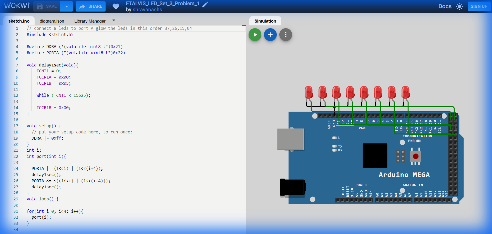

# Set 3 Problem 1: Parallel LED Pairs (Port A)

## Problem Statement
Connect 8 LEDs to **Port A**.
Light up **pairs** of LEDs simultaneously in a specific sequence:
1.  Light 0 and 4.
2.  Light 1 and 5.
3.  Light 2 and 6.
4.  Light 3 and 7.

## Simple Explanation
Imagine the LEDs are split into two groups of 4:
-   Group 1: 0, 1, 2, 3
-   Group 2: 4, 5, 6, 7
We turn on the FIRST light of Group 1 and the FIRST light of Group 2 together. Then the SECOND light of both groups... etc.

## Hardware Setup
-   **Port A**: Address `0x22`.

## Code Analysis

```c
#include <stdint.h>
#define DDRA (*(volatile uint8_t*)0x21)
#define PORTA (*(volatile uint8_t*)0x22)

void delay1sec(void){
    TCNT1 = 0; TCCR1A = 0x00; TCCR1B = 0x05;
    while (TCNT1 < 15625);
    TCCR1B = 0x00;
}

void setup() {
  DDRA |= 0xFF; // All Output
}

// Helper function to turn on the i-th and (i+4)-th LED
void port(int i){
  // Calculate the mask:
  // If i=0, (1<<0) is 00000001
  //        (1<<4) is 00010000
  // Combined (|): 00010001 (0x11)
  PORTA |= (1<<i) | (1<<(i+4));
  delay1sec();
  
  // Turn them OFF
  PORTA &= ~((1<<i) | (1<<(i+4)));
  delay1sec();
}

void loop() {
  // Loop 0 to 3
  for(int i=0; i<4; i++){
    port(i);
  }
}
```

## What I Learnt
-   **Parallel Logic**: How to control two physically separated pins (like 0 and 4) using a mathematical relationship (`i` and `i+4`).
-   **Functions**: Breaking code into a separate `port(i)` function makes the main `loop` much cleaner.

## Circuit Diagram (JSON Schematic)

```json
{
  "version": 1,
  "author": "ShravanaHS",
  "editor": "wokwi",
  "parts": [
    { "type": "wokwi-arduino-mega", "id": "mega", "top": 0, "left": 0, "attrs": {} },
    { "type": "wokwi-resistor", "id": "r1", "top": 50,  "left": 220, "attrs": { "value": "220" } },
    { "type": "wokwi-led",      "id": "led1", "top": 50,  "left": 310, "attrs": { "color": "red" } },
    { "type": "wokwi-resistor", "id": "r2", "top": 100, "left": 220, "attrs": { "value": "220" } },
    { "type": "wokwi-led",      "id": "led2", "top": 100, "left": 310, "attrs": { "color": "red" } },
    { "type": "wokwi-resistor", "id": "r3", "top": 150, "left": 220, "attrs": { "value": "220" } },
    { "type": "wokwi-led",      "id": "led3", "top": 150, "left": 310, "attrs": { "color": "red" } },
    { "type": "wokwi-resistor", "id": "r4", "top": 200, "left": 220, "attrs": { "value": "220" } },
    { "type": "wokwi-led",      "id": "led4", "top": 200, "left": 310, "attrs": { "color": "red" } },
    { "type": "wokwi-resistor", "id": "r5", "top": 250, "left": 220, "attrs": { "value": "220" } },
    { "type": "wokwi-led",      "id": "led5", "top": 250, "left": 310, "attrs": { "color": "red" } },
    { "type": "wokwi-resistor", "id": "r6", "top": 300, "left": 220, "attrs": { "value": "220" } },
    { "type": "wokwi-led",      "id": "led6", "top": 300, "left": 310, "attrs": { "color": "red" } },
    { "type": "wokwi-resistor", "id": "r7", "top": 350, "left": 220, "attrs": { "value": "220" } },
    { "type": "wokwi-led",      "id": "led7", "top": 350, "left": 310, "attrs": { "color": "red" } },
    { "type": "wokwi-resistor", "id": "r8", "top": 400, "left": 220, "attrs": { "value": "220" } },
    { "type": "wokwi-led",      "id": "led8", "top": 400, "left": 310, "attrs": { "color": "red" } }
  ],
  "connections": [
    [ "mega:22", "r1:1", "green", [] ], [ "r1:2", "led1:A", "green", [] ], [ "led1:K", "mega:GND.1", "black", [] ],
    [ "mega:23", "r2:1", "blue",  [] ], [ "r2:2", "led2:A", "blue",  [] ], [ "led2:K", "mega:GND.1", "black", [] ],
    [ "mega:24", "r3:1", "green", [] ], [ "r3:2", "led3:A", "green", [] ], [ "led3:K", "mega:GND.1", "black", [] ],
    [ "mega:25", "r4:1", "blue",  [] ], [ "r4:2", "led4:A", "blue",  [] ], [ "led4:K", "mega:GND.1", "black", [] ],
    [ "mega:26", "r5:1", "green", [] ], [ "r5:2", "led5:A", "green", [] ], [ "led5:K", "mega:GND.1", "black", [] ],
    [ "mega:27", "r6:1", "blue",  [] ], [ "r6:2", "led6:A", "blue",  [] ], [ "led6:K", "mega:GND.1", "black", [] ],
    [ "mega:28", "r7:1", "green", [] ], [ "r7:2", "led7:A", "green", [] ], [ "led7:K", "mega:GND.1", "black", [] ],
    [ "mega:29", "r8:1", "blue",  [] ], [ "r8:2", "led8:A", "blue",  [] ], [ "led8:K", "mega:GND.1", "black", [] ]
  ]
}
```

> **Pin Mapping**: Port A Bits 0-7 = MEGA Pins 22-29. Pairs: (LED0+LED4), (LED1+LED5), (LED2+LED6), (LED3+LED7) blink together.

## Visuals

[Click here to run the simulation on Wokwi](https://wokwi.com/projects/451229712541347841)
