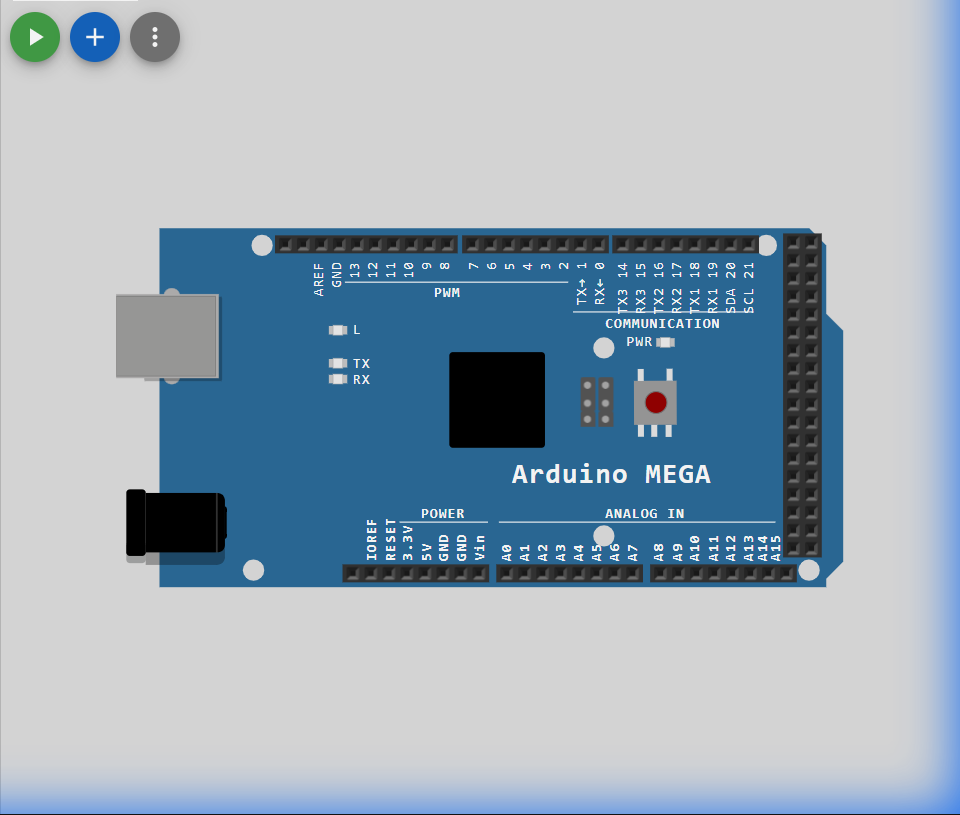

# Set 3 Problem 10: Accumulate Reverse

## Problem Statement
Imagine filling a glass of water from the top down (conceptually). We want to turn on the LEDs starting from the highest number (LED 7) down to the lowest (LED 0).
**Crucially**, once an LED turns on, it **stays on**.
1.  Turn on LED 7 -> Wait.
2.  Turn on LED 6 (so 7 and 6 are now ON) -> Wait.
3.  Turn on LED 5 (so 7, 6, 5 are ON) -> Wait...
4.  Eventually, all LEDs from 7 to 0 will be ON.

## Simple Explanation
This is like building a tower of blocks, but we are placing the blocks from left to right (or high bit to low bit) and leaving them there.
-   We start with an empty set.
-   We Add "Bit 7".
-   We Add "Bit 6".
-   We are **Accumulating** (gathering) the lights.

## Hardware Setup
-   **Port Used**: Port A.
-   **Direction**: `i--` implies we are counting backwards (Countdown).

## Code Analysis

```c
#include <stdint.h>

// Addresses for Port A
#define DDRA  (*(volatile uint8_t*)0x21)
#define PORTA (*(volatile uint8_t*)0x22)

// Accurate 1-second delay using Timer 1
void delay1sec(void){
    TCNT1  = 0;
    TCCR1A = 0x00;
    TCCR1B = 0x05;
    while (TCNT1 < 15625);
    TCCR1B = 0x00;
}

void setup() {
    DDRA = 0xFF; // Set all Port A pins to Output
}

void loop() {
    // The Loop: Start 'i' at 7, and go down as long as 'i' is greater than or equal to 0.
    // Decrement 'i' by 1 each time (i--).
    for (int8_t i = 7; i >= 0; i--) {
      
      // The Core Logic: Accumulation
      // We use the OR Operator (|=). 
      // PORTA |= (1<<i) says "Keep whatever bits are already ON, AND turn on bit 'i'".
      // If we used '=', it would erase the old lights. '|=' keeps them.
      PORTA |= (1<<i);
      
      delay1sec();
    }
}
```

## What I Learnt
-   **Accumulation with OR**: The most important lesson here is the difference between `=` (Assignment) and `|=` (Bitwise OR Assignment).
    -   `PORTA = (1<<i)` would turn ON only the current LED and turn OFF the rest.
    -   `PORTA |= (1<<i)` turns ON the current LED and **leaves the others alone**.
-   **Reverse Loops**: How to write a loop that counts backwards (`i--`).
-   **Signed vs Unsigned**: In the loop, we must use a signed integer (`int8_t`) or carefully check `i >= 0`. If we used an `unsigned` byte, `0 - 1` would wrap around to `255`, causing an infinite loop!

## Circuit Diagram (JSON Schematic)

```json
{
  "version": 1,
  "author": "ShravanaHS",
  "editor": "wokwi",
  "parts": [
    { "type": "wokwi-arduino-mega", "id": "mega", "top": 0, "left": 0, "attrs": {} },
    { "type": "wokwi-resistor", "id": "r1", "top": 50,  "left": 220, "attrs": { "value": "220" } },
    { "type": "wokwi-led",      "id": "led1", "top": 50,  "left": 310, "attrs": { "color": "red" } },
    { "type": "wokwi-resistor", "id": "r2", "top": 100, "left": 220, "attrs": { "value": "220" } },
    { "type": "wokwi-led",      "id": "led2", "top": 100, "left": 310, "attrs": { "color": "red" } },
    { "type": "wokwi-resistor", "id": "r3", "top": 150, "left": 220, "attrs": { "value": "220" } },
    { "type": "wokwi-led",      "id": "led3", "top": 150, "left": 310, "attrs": { "color": "red" } },
    { "type": "wokwi-resistor", "id": "r4", "top": 200, "left": 220, "attrs": { "value": "220" } },
    { "type": "wokwi-led",      "id": "led4", "top": 200, "left": 310, "attrs": { "color": "red" } },
    { "type": "wokwi-resistor", "id": "r5", "top": 250, "left": 220, "attrs": { "value": "220" } },
    { "type": "wokwi-led",      "id": "led5", "top": 250, "left": 310, "attrs": { "color": "red" } },
    { "type": "wokwi-resistor", "id": "r6", "top": 300, "left": 220, "attrs": { "value": "220" } },
    { "type": "wokwi-led",      "id": "led6", "top": 300, "left": 310, "attrs": { "color": "red" } },
    { "type": "wokwi-resistor", "id": "r7", "top": 350, "left": 220, "attrs": { "value": "220" } },
    { "type": "wokwi-led",      "id": "led7", "top": 350, "left": 310, "attrs": { "color": "red" } },
    { "type": "wokwi-resistor", "id": "r8", "top": 400, "left": 220, "attrs": { "value": "220" } },
    { "type": "wokwi-led",      "id": "led8", "top": 400, "left": 310, "attrs": { "color": "red" } }
  ],
  "connections": [
    [ "mega:22", "r1:1", "green", [] ], [ "r1:2", "led1:A", "green", [] ], [ "led1:K", "mega:GND.1", "black", [] ],
    [ "mega:23", "r2:1", "blue",  [] ], [ "r2:2", "led2:A", "blue",  [] ], [ "led2:K", "mega:GND.1", "black", [] ],
    [ "mega:24", "r3:1", "green", [] ], [ "r3:2", "led3:A", "green", [] ], [ "led3:K", "mega:GND.1", "black", [] ],
    [ "mega:25", "r4:1", "blue",  [] ], [ "r4:2", "led4:A", "blue",  [] ], [ "led4:K", "mega:GND.1", "black", [] ],
    [ "mega:26", "r5:1", "green", [] ], [ "r5:2", "led5:A", "green", [] ], [ "led5:K", "mega:GND.1", "black", [] ],
    [ "mega:27", "r6:1", "blue",  [] ], [ "r6:2", "led6:A", "blue",  [] ], [ "led6:K", "mega:GND.1", "black", [] ],
    [ "mega:28", "r7:1", "green", [] ], [ "r7:2", "led7:A", "green", [] ], [ "led7:K", "mega:GND.1", "black", [] ],
    [ "mega:29", "r8:1", "blue",  [] ], [ "r8:2", "led8:A", "blue",  [] ], [ "led8:K", "mega:GND.1", "black", [] ]
  ]
}
```

> **Pin Mapping**: Port A Bits 0-7 = MEGA Pins 22-29 (PA0=Pin22, PA1=Pin23, ..., PA7=Pin29).

## Visuals

[Click here to run the simulation on Wokwi](https://wokwi.com/projects/451233531907399681)
