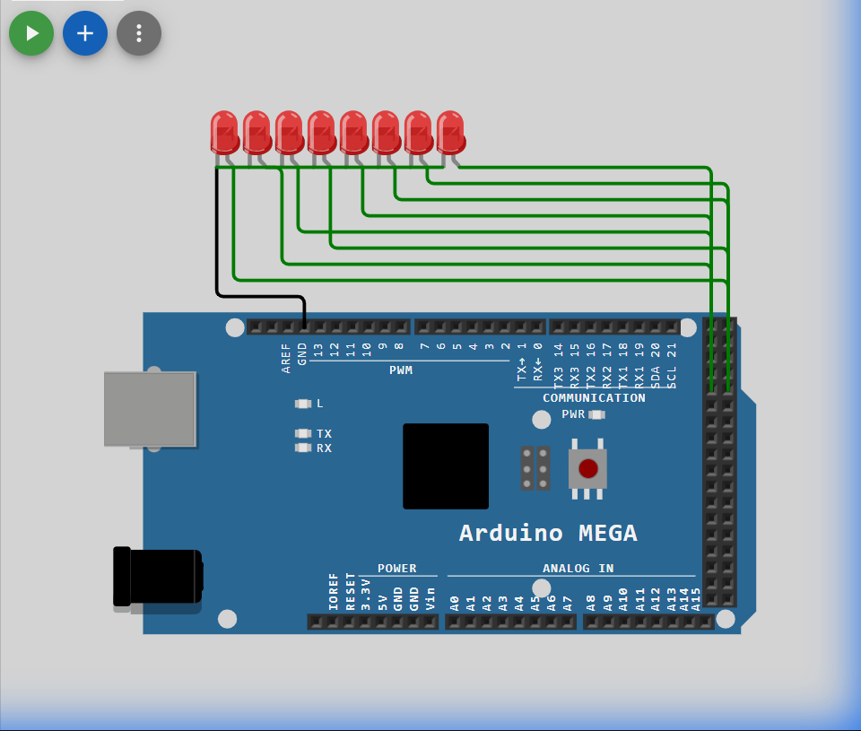

# Set 3 Problem 4: Custom Array Sequence (Port A)

## Problem Statement
Connect 8 LEDs to **Port A**.
Blink them in a **Custom Chaotic Order**: 0, 2, 1, 3, 4, 6, 5, 7.

## Simple Explanation
Instead of 1-2-3-4 (Counting), we want to jump around.
We use a "lookup table" (an Array) to tell us where to go next.
-   Step 0: Go to LED 0.
-   Step 1: Go to LED 2.
-   Step 2: Go to LED 1.
...

## Hardware Setup
-   **Port A**: Address `0x22`.

## Code Analysis

```c
#include <stdint.h>
#define DDRA (*(volatile uint8_t*)0x21)
#define PORTA (*(volatile uint8_t*)0x22)

// The Lookup Table
// We define the specific order we want here.
uint8_t pattern[8] = {0, 2, 1, 3, 4, 6, 5, 7};

void delay1sec(void){
    TCNT1  = 0; TCCR1A = 0x00; TCCR1B = 0x05;
    while (TCNT1 < 15625);
    TCCR1B = 0x00;
}

void setup() {
    DDRA = 0xFF; // All Output
}

void loop() {
    // Iterate through the 8 steps of our sequence
    for (uint8_t i = 0; i < 8; i++) {
        // Read the target LED pin from the array using 'i' as the index.
        uint8_t targetPin = pattern[i];
        
        // Turn ON that pin
        PORTA = (1 << targetPin);
        delay1sec();
        
        // Turn OFF
        PORTA = 0x00;
        delay1sec();
    }
}
```

## What I Learnt
-   **Lookup Tables (LUTs)**: Using an array to store data (the sequence) separates the *Logic* (the loop) from the *Data* (the pattern). This is powerful. If we want to change the visual pattern later, we only change the numbers in `{...}`, not the code!

## Circuit Diagram (JSON Schematic)

```json
{
  "version": 1,
  "author": "ShravanaHS",
  "editor": "wokwi",
  "parts": [
    { "type": "wokwi-arduino-mega", "id": "mega", "top": 0, "left": 0, "attrs": {} },
    { "type": "wokwi-resistor", "id": "r1", "top": 50,  "left": 220, "attrs": { "value": "220" } },
    { "type": "wokwi-led",      "id": "led1", "top": 50,  "left": 310, "attrs": { "color": "red" } },
    { "type": "wokwi-resistor", "id": "r2", "top": 100, "left": 220, "attrs": { "value": "220" } },
    { "type": "wokwi-led",      "id": "led2", "top": 100, "left": 310, "attrs": { "color": "red" } },
    { "type": "wokwi-resistor", "id": "r3", "top": 150, "left": 220, "attrs": { "value": "220" } },
    { "type": "wokwi-led",      "id": "led3", "top": 150, "left": 310, "attrs": { "color": "red" } },
    { "type": "wokwi-resistor", "id": "r4", "top": 200, "left": 220, "attrs": { "value": "220" } },
    { "type": "wokwi-led",      "id": "led4", "top": 200, "left": 310, "attrs": { "color": "red" } },
    { "type": "wokwi-resistor", "id": "r5", "top": 250, "left": 220, "attrs": { "value": "220" } },
    { "type": "wokwi-led",      "id": "led5", "top": 250, "left": 310, "attrs": { "color": "red" } },
    { "type": "wokwi-resistor", "id": "r6", "top": 300, "left": 220, "attrs": { "value": "220" } },
    { "type": "wokwi-led",      "id": "led6", "top": 300, "left": 310, "attrs": { "color": "red" } },
    { "type": "wokwi-resistor", "id": "r7", "top": 350, "left": 220, "attrs": { "value": "220" } },
    { "type": "wokwi-led",      "id": "led7", "top": 350, "left": 310, "attrs": { "color": "red" } },
    { "type": "wokwi-resistor", "id": "r8", "top": 400, "left": 220, "attrs": { "value": "220" } },
    { "type": "wokwi-led",      "id": "led8", "top": 400, "left": 310, "attrs": { "color": "red" } }
  ],
  "connections": [
    [ "mega:22", "r1:1", "green", [] ], [ "r1:2", "led1:A", "green", [] ], [ "led1:K", "mega:GND.1", "black", [] ],
    [ "mega:23", "r2:1", "blue",  [] ], [ "r2:2", "led2:A", "blue",  [] ], [ "led2:K", "mega:GND.1", "black", [] ],
    [ "mega:24", "r3:1", "green", [] ], [ "r3:2", "led3:A", "green", [] ], [ "led3:K", "mega:GND.1", "black", [] ],
    [ "mega:25", "r4:1", "blue",  [] ], [ "r4:2", "led4:A", "blue",  [] ], [ "led4:K", "mega:GND.1", "black", [] ],
    [ "mega:26", "r5:1", "green", [] ], [ "r5:2", "led5:A", "green", [] ], [ "led5:K", "mega:GND.1", "black", [] ],
    [ "mega:27", "r6:1", "blue",  [] ], [ "r6:2", "led6:A", "blue",  [] ], [ "led6:K", "mega:GND.1", "black", [] ],
    [ "mega:28", "r7:1", "green", [] ], [ "r7:2", "led7:A", "green", [] ], [ "led7:K", "mega:GND.1", "black", [] ],
    [ "mega:29", "r8:1", "blue",  [] ], [ "r8:2", "led8:A", "blue",  [] ], [ "led8:K", "mega:GND.1", "black", [] ]
  ]
}
```

> **Pin Mapping**: Port A Bits 0-7 = MEGA Pins 22-29 (PA0=Pin22, PA1=Pin23, ..., PA7=Pin29).

## Visuals

[Click here to run the simulation on Wokwi](https://wokwi.com/projects/451230395192699905)
