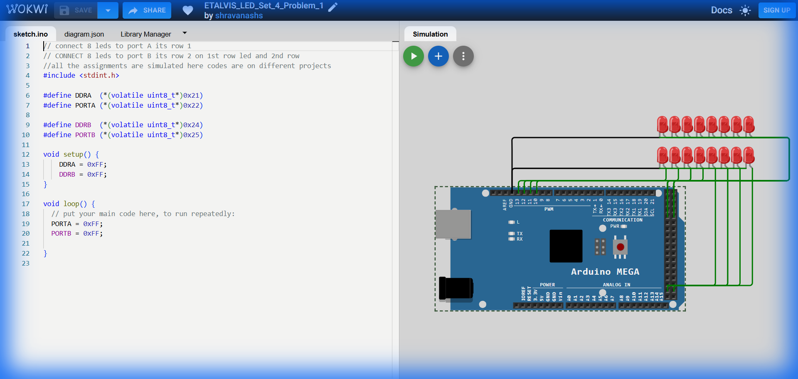

# Set 4 Problem 1: Dual Port ON

## Problem Statement
Connect 8 LEDs to **Port A** (Row 1) and 8 LEDs to **Port B** (Row 2).
Turn **ALL** LEDs on both ports ON.

## Hardware Setup
-   **Port A**: Row 1 LEDs.
-   **Port B**: Row 2 LEDs.
-   **Registers**: `DDRA`, `PORTA`, `DDRB`, `PORTB`.

## Code Analysis

```c
#include <stdint.h>

#define DDRA  (*(volatile uint8_t*)0x21)
#define PORTA (*(volatile uint8_t*)0x22)

#define DDRB  (*(volatile uint8_t*)0x24)
#define PORTB (*(volatile uint8_t*)0x25)

void setup() {
    // Set both Ports to Output Mode
    DDRA = 0xFF;   
    DDRB = 0xFF;  
}

void loop() {
  // Turn all pins HIGH on both ports
  PORTA = 0xFF;
  PORTB = 0xFF;
}
```

## Visuals

[Click here to run the simulation on Wokwi](https://wokwi.com/projects/451305981969614849)
