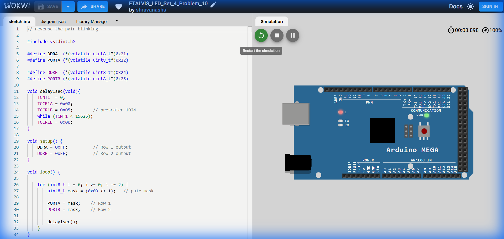

# Set 4 Problem 10: Reverse Pair Blink

## Problem Statement
Blink pairs of LEDs in reverse order (7-6 to 1-0) on **Port A** and **Port B**.
Pairs: (6,7), (4,5), (2,3), (0,1).

## Code Analysis

```c
#include <stdint.h>

#define DDRA (*(volatile uint8_t*)0x21)
#define PORTA (*(volatile uint8_t*)0x22)

#define DDRB (*(volatile uint8_t*)0x24)
#define PORTB (*(volatile uint8_t*)0x25)

void delay1sec(void){
  TCNT1 = 0;
  TCCR1A = 0x00;
  TCCR1B = 0x05;      // prescaler 1024
  while (TCNT1 < 15625);
  TCCR1B = 0x00;
}

void setup() {
  DDRA = 0xFF;        // Row 1 output
  DDRB = 0xFF;        // Row 2 output
}

void loop() {
  // i starts at 6 and goes down to 0
  for (int8_t i = 6; i >= 0; i -= 2) {
    // 0x03 is 00000011.
    // Shifting it by 6 gives 11000000 (Bits 7 and 6).
    uint8_t mask = (0x03 << i);  

    PORTA = mask;      // Row 1
    PORTB = mask;      // Row 2

    delay1sec();
  }
}
```

## Circuit Diagram (JSON Schematic)

```json
{
  "version": 1,
  "author": "ShravanaHS",
  "editor": "wokwi",
  "parts": [
    { "type": "wokwi-arduino-mega", "id": "mega", "top": 0, "left": 0, "attrs": {} },
    { "type": "wokwi-resistor", "id": "r1", "top": 50, "left": 220, "attrs": { "value": "220" } },
    { "type": "wokwi-led", "id": "a0", "top": 50, "left": 310, "attrs": { "color": "red" } },
    { "type": "wokwi-resistor", "id": "r2", "top": 80, "left": 220, "attrs": { "value": "220" } },
    { "type": "wokwi-led", "id": "a1", "top": 80, "left": 310, "attrs": { "color": "red" } },
    { "type": "wokwi-resistor", "id": "r3", "top": 110, "left": 220, "attrs": { "value": "220" } },
    { "type": "wokwi-led", "id": "a2", "top": 110, "left": 310, "attrs": { "color": "red" } },
    { "type": "wokwi-resistor", "id": "r4", "top": 140, "left": 220, "attrs": { "value": "220" } },
    { "type": "wokwi-led", "id": "a3", "top": 140, "left": 310, "attrs": { "color": "red" } },
    { "type": "wokwi-resistor", "id": "r5", "top": 170, "left": 220, "attrs": { "value": "220" } },
    { "type": "wokwi-led", "id": "a4", "top": 170, "left": 310, "attrs": { "color": "red" } },
    { "type": "wokwi-resistor", "id": "r6", "top": 200, "left": 220, "attrs": { "value": "220" } },
    { "type": "wokwi-led", "id": "a5", "top": 200, "left": 310, "attrs": { "color": "red" } },
    { "type": "wokwi-resistor", "id": "r7", "top": 230, "left": 220, "attrs": { "value": "220" } },
    { "type": "wokwi-led", "id": "a6", "top": 230, "left": 310, "attrs": { "color": "red" } },
    { "type": "wokwi-resistor", "id": "r8", "top": 260, "left": 220, "attrs": { "value": "220" } },
    { "type": "wokwi-led", "id": "a7", "top": 260, "left": 310, "attrs": { "color": "red" } },
    { "type": "wokwi-resistor", "id": "r9", "top": 310, "left": 220, "attrs": { "value": "220" } },
    { "type": "wokwi-led", "id": "b0", "top": 310, "left": 310, "attrs": { "color": "blue" } },
    { "type": "wokwi-resistor", "id": "r10", "top": 340, "left": 220, "attrs": { "value": "220" } },
    { "type": "wokwi-led", "id": "b1", "top": 340, "left": 310, "attrs": { "color": "blue" } },
    { "type": "wokwi-resistor", "id": "r11", "top": 370, "left": 220, "attrs": { "value": "220" } },
    { "type": "wokwi-led", "id": "b2", "top": 370, "left": 310, "attrs": { "color": "blue" } },
    { "type": "wokwi-resistor", "id": "r12", "top": 400, "left": 220, "attrs": { "value": "220" } },
    { "type": "wokwi-led", "id": "b3", "top": 400, "left": 310, "attrs": { "color": "blue" } },
    { "type": "wokwi-resistor", "id": "r13", "top": 430, "left": 220, "attrs": { "value": "220" } },
    { "type": "wokwi-led", "id": "b4", "top": 430, "left": 310, "attrs": { "color": "blue" } },
    { "type": "wokwi-resistor", "id": "r14", "top": 460, "left": 220, "attrs": { "value": "220" } },
    { "type": "wokwi-led", "id": "b5", "top": 460, "left": 310, "attrs": { "color": "blue" } },
    { "type": "wokwi-resistor", "id": "r15", "top": 490, "left": 220, "attrs": { "value": "220" } },
    { "type": "wokwi-led", "id": "b6", "top": 490, "left": 310, "attrs": { "color": "blue" } },
    { "type": "wokwi-resistor", "id": "r16", "top": 520, "left": 220, "attrs": { "value": "220" } },
    { "type": "wokwi-led", "id": "b7", "top": 520, "left": 310, "attrs": { "color": "blue" } }
  ],
  "connections": [
    ["mega:22","r1:1","red",[]], ["r1:2","a0:A","red",[]], ["a0:K","mega:GND.1","black",[]],
    ["mega:23","r2:1","red",[]], ["r2:2","a1:A","red",[]], ["a1:K","mega:GND.1","black",[]],
    ["mega:24","r3:1","red",[]], ["r3:2","a2:A","red",[]], ["a2:K","mega:GND.1","black",[]],
    ["mega:25","r4:1","red",[]], ["r4:2","a3:A","red",[]], ["a3:K","mega:GND.1","black",[]],
    ["mega:26","r5:1","red",[]], ["r5:2","a4:A","red",[]], ["a4:K","mega:GND.1","black",[]],
    ["mega:27","r6:1","red",[]], ["r6:2","a5:A","red",[]], ["a5:K","mega:GND.1","black",[]],
    ["mega:28","r7:1","red",[]], ["r7:2","a6:A","red",[]], ["a6:K","mega:GND.1","black",[]],
    ["mega:29","r8:1","red",[]], ["r8:2","a7:A","red",[]], ["a7:K","mega:GND.1","black",[]],
    ["mega:53","r9:1","blue",[]], ["r9:2","b0:A","blue",[]], ["b0:K","mega:GND.1","black",[]],
    ["mega:52","r10:1","blue",[]], ["r10:2","b1:A","blue",[]], ["b1:K","mega:GND.1","black",[]],
    ["mega:51","r11:1","blue",[]], ["r11:2","b2:A","blue",[]], ["b2:K","mega:GND.1","black",[]],
    ["mega:50","r12:1","blue",[]], ["r12:2","b3:A","blue",[]], ["b3:K","mega:GND.1","black",[]],
    ["mega:10","r13:1","blue",[]], ["r13:2","b4:A","blue",[]], ["b4:K","mega:GND.1","black",[]],
    ["mega:11","r14:1","blue",[]], ["r14:2","b5:A","blue",[]], ["b5:K","mega:GND.1","black",[]],
    ["mega:12","r15:1","blue",[]], ["r15:2","b6:A","blue",[]], ["b6:K","mega:GND.1","black",[]],
    ["mega:13","r16:1","blue",[]], ["r16:2","b7:A","blue",[]], ["b7:K","mega:GND.1","black",[]]
  ]
}
```

> **Pin Mapping**: Row 1 = Port A Pins 22-29. Row 2 = Port B Pins 53,52,51,50,10,11,12,13.

## Visuals

[Click here to run the simulation on Wokwi](https://wokwi.com/projects/451306204462786561)
