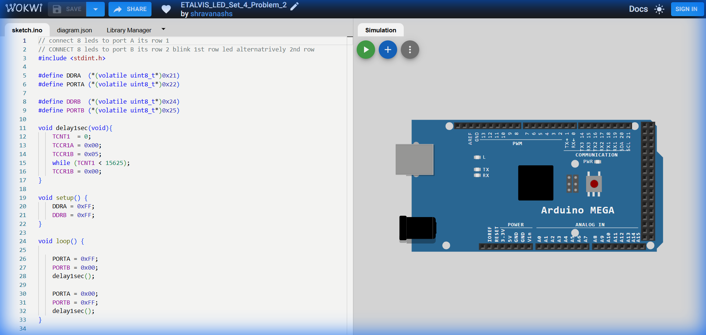

# Set 4 Problem 2: Alternating Rows

## Problem Statement
Connect 8 LEDs to **Port A** (Row 1) and 8 LEDs to **Port B** (Row 2).
Blink the rows alternatingly:
1.  Row 1 ON / Row 2 OFF.
2.  Row 1 OFF / Row 2 ON.

## Code Analysis

```c
#include <stdint.h>

#define DDRA  (*(volatile uint8_t*)0x21)
#define PORTA (*(volatile uint8_t*)0x22)

#define DDRB  (*(volatile uint8_t*)0x24)
#define PORTB (*(volatile uint8_t*)0x25)

// Custom delay function using Timer1
void delay1sec(void){
    TCNT1 = 0;
    TCCR1A = 0x00;
    TCCR1B = 0x05; // Set Prescaler to 1024
    // 16MHz / 1024 = 15625 Hz.
    // Waiting for 15625 ticks = 1 Second.
    while (TCNT1 < 15625);
    TCCR1B = 0x00; // Stop Timer
}

void setup() {
    DDRA = 0xFF;
    DDRB = 0xFF;
}

void loop() {
    // Row 1 ON, Row 2 OFF
    PORTA = 0xFF;
    PORTB = 0x00;
    delay1sec();

    // Row 1 OFF, Row 2 ON
    PORTA = 0x00;
    PORTB = 0xFF;
    delay1sec();
}
```

## Visuals

[Click here to run the simulation on Wokwi](https://wokwi.com/projects/451306004842207233)
