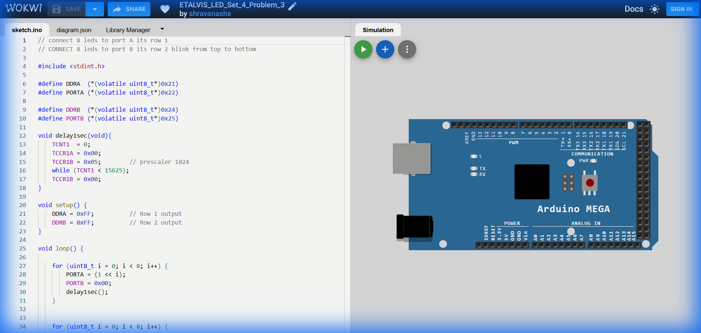

# Set 4 Problem 3: Sequential Row Blink

## Problem Statement
Connect 8 LEDs to **Port A** (Row 1) and 8 LEDs to **Port B** (Row 2).
Blink every LED one by one:
1.  Sequence through Row 1 (0 to 7).
2.  Sequence through Row 2 (0 to 7).

## Code Analysis

```c
#include <stdint.h>
#define DDRA  (*(volatile uint8_t*)0x21)
#define PORTA (*(volatile uint8_t*)0x22)
#define DDRB  (*(volatile uint8_t*)0x24)
#define PORTB (*(volatile uint8_t*)0x25)

void delay1sec(void){
    TCNT1  = 0;
    TCCR1A = 0x00;
    TCCR1B = 0x05;        // prescaler 1024
    while (TCNT1 < 15625);
    TCCR1B = 0x00;
}

void setup() {
    DDRA = 0xFF;          // Row 1 output
    DDRB = 0xFF;          // Row 2 output
}

void loop() {
    // Loop through Row 1
    for (uint8_t i = 0; i < 8; i++) {
        PORTA = (1 << i); // Turn on 1 bit
        PORTB = 0x00;     // Ensure Row 2 is OFF
        delay1sec();
    }
   
    // Loop through Row 2
    for (uint8_t i = 0; i < 8; i++) {
        PORTA = 0x00;     // Ensure Row 1 is OFF
        PORTB = (1 << i); // Turn on 1 bit
        delay1sec();
    }
}
```

## Visuals

[Click here to run the simulation on Wokwi](https://wokwi.com/projects/451306020763787265)
