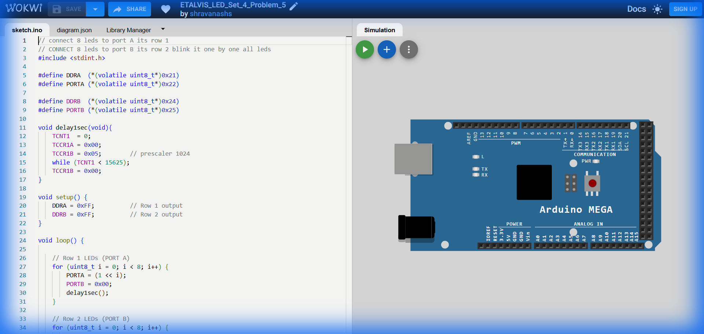

# Set 4 Problem 5: Row-by-Row Sequence

## Problem Statement
Identical to Problem 3: Blink LEDs one by one on Port A, then one by one on Port B.

## Code Analysis

```c
#include <stdint.h>

#define DDRA  (*(volatile uint8_t*)0x21)
#define PORTA (*(volatile uint8_t*)0x22)

#define DDRB  (*(volatile uint8_t*)0x24)
#define PORTB (*(volatile uint8_t*)0x25)

void delay1sec(void){
    TCNT1 = 0;
    TCCR1A = 0x00;
    TCCR1B = 0x05;        // prescaler 1024
    while (TCNT1 < 15625);
    TCCR1B = 0x00;
}

void setup() {
    DDRA = 0xFF;          // Row 1 output
    DDRB = 0xFF;          // Row 2 output
}

void loop() {

    // Row 1 LEDs (PORT A)
    for (uint8_t i = 0; i < 8; i++) {
        PORTA = (1 << i);
        PORTB = 0x00;
        delay1sec();
    }

    // Row 2 LEDs (PORT B)
    for (uint8_t i = 0; i < 8; i++) {
        PORTA = 0x00;
        PORTB = (1 << i);
        delay1sec();
    }
}
```

## Visuals

[Click here to run the simulation on Wokwi](https://wokwi.com/projects/451306040146719745)
