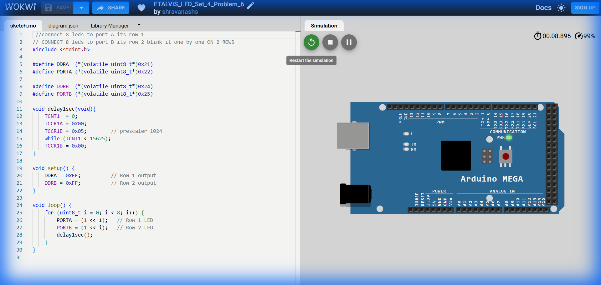

# Set 4 Problem 6: Parallel Sequential Mirror

## Problem Statement
Blink LEDs one by one on **Port A** and **Port B** simultaneously.
(Note: This appears identical to Problem 4 based on the provided code).

## Code Analysis

```c
#include <stdint.h>

#define DDRA  (*(volatile uint8_t*)0x21)
#define PORTA (*(volatile uint8_t*)0x22)

#define DDRB  (*(volatile uint8_t*)0x24)
#define PORTB (*(volatile uint8_t*)0x25)

void delay1sec(void){
  TCNT1 = 0;
  TCCR1A = 0x00;
  TCCR1B = 0x05;      // prescaler 1024
  while (TCNT1 < 15625);
  TCCR1B = 0x00;
}

void setup() {
  DDRA = 0xFF;        // Row 1 output
  DDRB = 0xFF;        // Row 2 output
}

void loop() {
  // Loop through bits 0 to 7
  for (uint8_t i = 0; i < 8; i++) {
    // Turn on the i-th LED on BOTH ports
    PORTA = (1 << i);    
    PORTB = (1 << i);    
    delay1sec();
  }
}
```

## Visuals

[Click here to run the simulation on Wokwi](https://wokwi.com/projects/451306091675844609)
