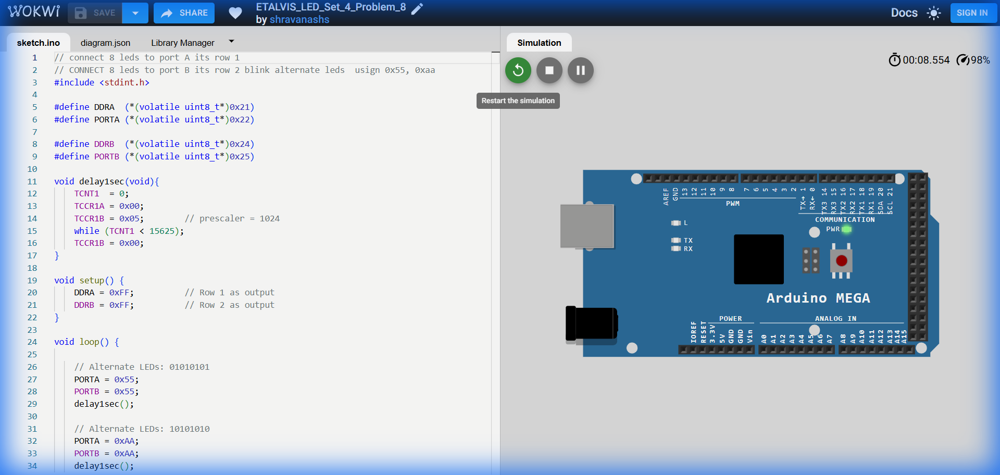

# Set 4 Problem 8: Alternate Pattern Blink

## Problem Statement
Blink alternating patterns on **Port A** and **Port B**.
-   State 1: `0x55` (01010101)
-   State 2: `0xAA` (10101010)

## Code Analysis

```c
#include <stdint.h>

#define DDRA (*(volatile uint8_t*)0x21)
#define PORTA (*(volatile uint8_t*)0x22)

#define DDRB (*(volatile uint8_t*)0x24)
#define PORTB (*(volatile uint8_t*)0x25)

void delay1sec(void){
  TCNT1 = 0;
  TCCR1A = 0x00;
  TCCR1B = 0x05;      // prescaler = 1024
  while (TCNT1 < 15625);
  TCCR1B = 0x00;
}

void setup() {
  DDRA = 0xFF;        // Row 1 as output
  DDRB = 0xFF;        // Row 2 as output
}

void loop() {
  // Alternate LEDs: 01010101
  PORTA = 0x55;
  PORTB = 0x55;
  delay1sec();

  // Alternate LEDs: 10101010
  PORTA = 0xAA;
  PORTB = 0xAA;
  delay1sec();
}
```

## Visuals

[Click here to run the simulation on Wokwi](https://wokwi.com/projects/451306164679805953)
