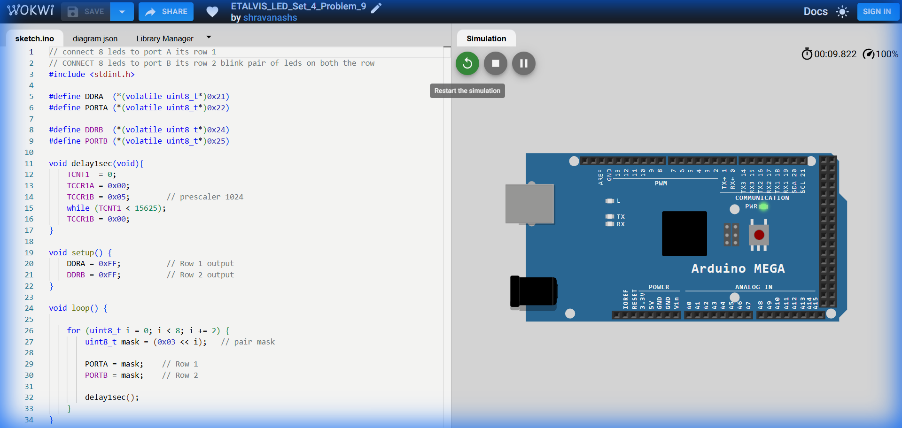

# Set 4 Problem 9: Pair Blink

## Problem Statement
Blink pairs of LEDs sequentially on **Port A** and **Port B**.
Pairs: (0,1), (2,3), (4,5), (6,7).

## Code Analysis

```c
#include <stdint.h>

#define DDRA (*(volatile uint8_t*)0x21)
#define PORTA (*(volatile uint8_t*)0x22)

#define DDRB (*(volatile uint8_t*)0x24)
#define PORTB (*(volatile uint8_t*)0x25)

void delay1sec(void){
  TCNT1 = 0;
  TCCR1A = 0x00;
  TCCR1B = 0x05;      // prescaler 1024
  while (TCNT1 < 15625);
  TCCR1B = 0x00;
}

void setup() {
  DDRA = 0xFF;        // Row 1 output
  DDRB = 0xFF;        // Row 2 output
}

void loop() {
  // i increments by 2 each time: 0, 2, 4, 6
  for (uint8_t i = 0; i < 8; i += 2) {
    // 0x03 is 00000011.
    // Shifting it left moves the pair of 1s.
    uint8_t mask = (0x03 << i);  

    PORTA = mask;      // Row 1
    PORTB = mask;      // Row 2

    delay1sec();
  }
}
```

## Visuals

[Click here to run the simulation on Wokwi](https://wokwi.com/projects/451306186028815361)
