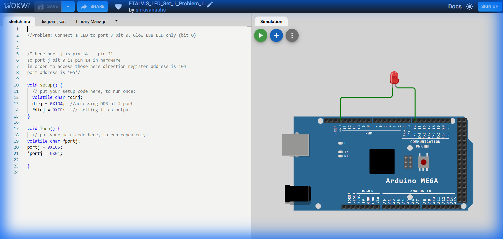

# Set 1 Problem 1: Single LED Blink (Port J)

## Problem Statement
We want to connect a single LED to the Arduino Mega and make it blink.
Specifically, we will connect it to **Port J** at **Bit 0** (Pin 14 on the board).
1.  Turn the LED ON.
2.  Wait for a while.
3.  Turn the LED OFF.
4.  Repeat.

## Simple Explanation
Think of a "Port" like a power strip with 8 sockets, numbered 0 to 7. We are plugging a lamp (LED) into socket #0.
To turn it on, we need to flip the switch for socket #0 to "ON" (send a `1`).
To turn it off, we flip the switch to "OFF" (send a `0`).

## Hardware Setup
-   **Port J**: A specific group of pins on the microcontroller.
-   **Bit 0**: The first pin in that group.
-   **Registers**:
    -   `DDRJ` (`0x104`): Controls direction (Input/Output). We need Output to power the LED.
    -   `PORTJ` (`0x105`): Controls the signal (High/Low).

## Code Analysis

```c
// Problem: Connect a LED to port J bit 0. Glow LSB LED only (bit 0)

void setup() {
  /* 
   * STEP 1: Configure the Direction
   * We need to tell the microcontroller that Port J will be used for OUTPUT (sending power out).
   * The address of the Data Direction Register for Port J (DDRJ) is 0x104.
   */
  volatile char *dirj;  // Create a pointer variable
  dirj = 0x104;         // Point it to address 0x104 (DDRJ)
  *dirj = 0xFF;         // Write 0xFF (11111111) to set ALL pins on Port J as Output.
}

void loop() {
  /* 
   * STEP 2: Control the Light
   * The address of the Data Register for Port J (PORTJ) is 0x105.
   */
  volatile char *portj; // Create a pointer
  portj = 0x105;        // Point it to address 0x105 (PORTJ)

  // Turn ON Bit 0
  // 0x01 in Hex is 00000001 in Binary.
  // This sends HIGH voltage to bit 0, turning the LED on.
  *portj = 0x01;
  
  // Note: This code lacks a delay() and a turn-off step, so the LED will just stay on forever!
  // In a proper blink program, we would add a delay and then set it to 0x00.
}
```

## What I Learnt
-   **Pointers**: Accessing hardware registers directly using pointers (e.g., `*dirj = 0xFF`).
-   **Memory Addresses**: Every pin on the Arduino maps to a specific number address in memory (like `0x104`).
-   **Volatile**: A keyword ensuring the computer doesn't "forget" to check these real-world addresses.

## Visuals

[Click here to run the simulation on Wokwi](https://wokwi.com/projects/450218684197143553)
