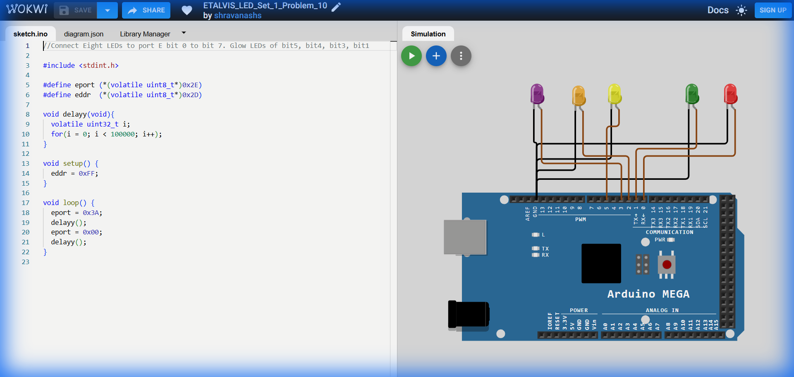

# Set 1 Problem 10: Specific Pattern Blink (Port E)

## Problem Statement
Connect LEDs to **Port E**.
Blink specifically the LEDs at **Bits 5, 4, 3, and 1**.

## Simple Explanation
We are picking a random-looking group of lights to control.
-   We want 5, 4, 3, 1 ON.
-   We want 7, 6, 2, 0 OFF.
-   Binary Map: `0` (7) `0` (6) `1` (5) `1` (4) `1` (3) `0` (2) `1` (1) `0` (0) -> `00111010`.

## Hardware Setup
-   **Port E**: Address `0x2E`.
-   **Registers**:
    -   `eddr` (`0x2D`): Direction.
    -   `eport` (`0x2E`): Data.

## Code Analysis

```c
#include <stdint.h>

#define eport (*(volatile uint8_t*)0x2E)
#define eddr  (*(volatile uint8_t*)0x2D)

void delayy(void){
  volatile uint32_t i;
  for(i = 0; i < 100000; i++);
}

void setup() {
  // Set all pins to Output
  eddr = 0xFF;
}

void loop() {
  // Apply our specific pattern
  // 0x3A is Hex for 00111010.
  // Breaks down as: 
  // 3 (0011) -> Bits 5 and 4 ON
  // A (1010) -> Bits 3 and 1 ON
  eport = 0x3A;
  delayy();

  // Turn everything OFF
  eport = 0x00;
  delayy();
}
```

## What I Learnt
-   **Custom Patterns**: How to convert any requested LED combination into a single Hex number.
-   **Hex Conversion**:
    -   `0011` (Upper 4 bits) -> `3`
    -   `1010` (Lower 4 bits) -> `A` (Ten)
    -   Combined -> `0x3A`.

## Visuals

[Click here to run the simulation on Wokwi](https://wokwi.com/projects/450288106353088513)
