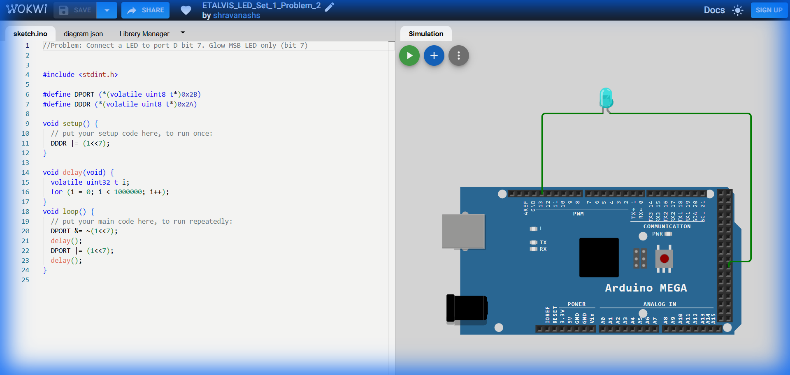

# Set 1 Problem 2: Single LED Blink (Port D)

## Problem Statement
Connect a single LED to **Port D** at **Bit 7** (the very last bit). Make it blink ON and OFF.

## Simple Explanation
This is similar to Problem 1, but we are using a different "power strip" (Port D) and the last socket (Socket #7).
-   Socket #7 corresponds to the "Most Significant Bit" (MSB) in a byte.
-   Binary: `10000000` (The '1' is at the far left).

## Hardware Setup
-   **Port D**: Another group of pins.
-   **Bit 7**: The MSB (Most Significant Bit).
-   **Registers**:
    -   `DDRD` (`0x2A`): Direction Register.
    -   `PORTD` (`0x2B`): Data Register.

## Code Analysis

```c
#include <stdint.h>

// Pre-defining the pointers makes the code cleaner.
// (volatile uint8_t*)0x2B casts the number 0x2B into a pointer.
// The outer * dereferences it so we can use it like a variable.
#define DPORT (*(volatile uint8_t*)0x2B) // Port D Data
#define DDDR (*(volatile uint8_t*)0x2A)  // Port D Direction

void setup() {
  // SETTING DIRECTION
  // We want to set ONLY Bit 7 to Output, without messing up pins 0-6.
  // 1 << 7 means "take a 1 and move it left 7 times" -> 10000000.
  // The '|=' (OR) operator combines this with the existing value.
  DDDR |= (1<<7); 
}

void delay(void) {
  // A simple busy-wait loop to pause execution.
  volatile uint32_t i;
  for (i = 0; i < 1000000; i++);
}

void loop() {
  // TURN OFF (Clear Bit 7)
  // 1 << 7 is 10000000.
  // ~(1 << 7) flips it to 01111111.
  // '&=' (AND) forces bit 7 to 0, leaving others unchanged.
  DPORT &= ~(1<<7);
  delay();

  // TURN ON (Set Bit 7)
  // '|=' sets bit 7 to 1.
  DPORT |= (1<<7);
  delay();
}
```

## What I Learnt
-   **Bit Shifting (`1 << 7`)**: A clearer way to visualize "Pin 7" compared to writing hex (`0x80`).
-   **Bitwise OR (`|=`)**: How to turn a pin ON without touching its neighbors.
-   **Bitwise AND-NOT (`&= ~`)**: The standard trick to turn a pin OFF safely.

## Visuals

[Click here to run the simulation on Wokwi](https://wokwi.com/projects/450221318023254017)
