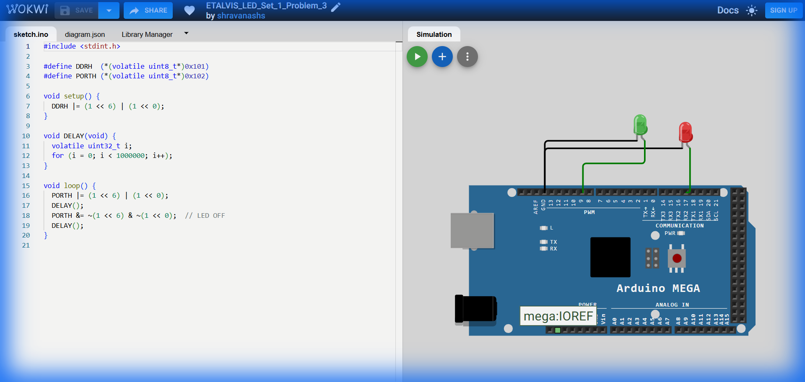

# Set 1 Problem 3: Two LED Blink (Port H)

## Problem Statement
Connect two LEDs to **Port H**.
-   One LED at **Bit 6**.
-   One LED at **Bit 0**.
Make them blink together (ON at the same time, OFF at the same time).

## Simple Explanation
We are plugging two lamps into our power strip: one at start (Socket 0) and one near the end (Socket 6).
We need to flip both switches simultaneously.
-   Binary Pattern: `01000001` (Bit 6 is 1, Bit 0 is 1).

## Hardware Setup
-   **Port H**: Address `0x102`.
-   **Registers**:
    -   `DDRH` (`0x101`): Direction.
    -   `PORTH` (`0x102`): Output.

## Code Analysis

```c
#include <stdint.h>

#define DDRH  (*(volatile uint8_t*)0x101)
#define PORTH (*(volatile uint8_t*)0x102)

void setup() {
  // Configure BOTH pins as Outputs at once.
  // (1 << 6) is 01000000
  // (1 << 0) is 00000001
  // Combined (|): 01000001
  DDRH |= (1 << 6) | (1 << 0);
}

void DELAY(void) {
  volatile uint32_t i;
  for (i = 0; i < 1000000; i++);
}

void loop() {
  // TURN ON both LEDs
  PORTH |= (1 << 6) | (1 << 0);    
  DELAY();

  // TURN OFF both LEDs
  // We use the same bitmask logic to clear them.
  // ~(1<<6) clears bit 6. ~(1<<0) clears bit 0.
  // Combining them clears both.
  PORTH &= ~(1 << 6) & ~(1 << 0);  
  DELAY();
}
```

## What I Learnt
-   **Combining Bitmasks**: How to manipulate multiple pins in a single line of code using `|` (OR).
-   **Simultaneous Control**: Bare metal programming allows modifying multiple pins in partially disconnected positions (0 and 6) instantly in one clock cycle.

## Visuals

[Click here to run the simulation on Wokwi](https://wokwi.com/projects/450284628790415361)
