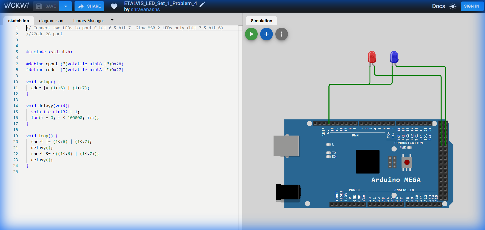

# Set 1 Problem 4: High Bit Blink (Port C)

## Problem Statement
Connect two LEDs to **Port C** at the two highest positions: **Bit 7** and **Bit 6**.
Blink them on and off.

## Simple Explanation
We are using the last two sockets of the port.
-   Bit 7 (MSB): Worth 128.
-   Bit 6: Worth 64.
-   Together: `11000000`.

## Hardware Setup
-   **Port C**: Address `0x28`.
-   **Registers**:
    -   `cddr` (`0x27`): Count Direction Register.
    -   `cport` (`0x28`): Data Register.

## Code Analysis

```c
#include <stdint.h>

#define cport (*(volatile uint8_t*)0x28)
#define cddr  (*(volatile uint8_t*)0x27)

void setup() {
  // Set Bit 6 and Bit 7 as Output.
  // (1<<6) | (1<<7) creates the mask 11000000.
  cddr |= (1<<6) | (1<<7);
}

void delayy(void){
  volatile uint32_t i;
  for(i = 0; i < 100000; i++);
}

void loop() {
  // Turn ON Bit 6 and 7
  cport |= (1<<6) | (1<<7);
  delayy();

  // Turn OFF Bit 6 and 7
  // We compute the mask (11000000), flip it (00111111), and AND it to clear the bits.
  cport &= ~((1<<6) | (1<<7));
  delayy();
}
```

## What I Learnt
-   **Grouping Bits**: Managing adjacent bits (6 and 7) is logically the same as managing disparate bits (0 and 6 from Problem 3).
-   **Masking**: The importance of parentheses `~((1<<6) | (1<<7))`—calculate the pattern first, *then* flip it.

## Visuals

[Click here to run the simulation on Wokwi](https://wokwi.com/projects/450287676924481537)
