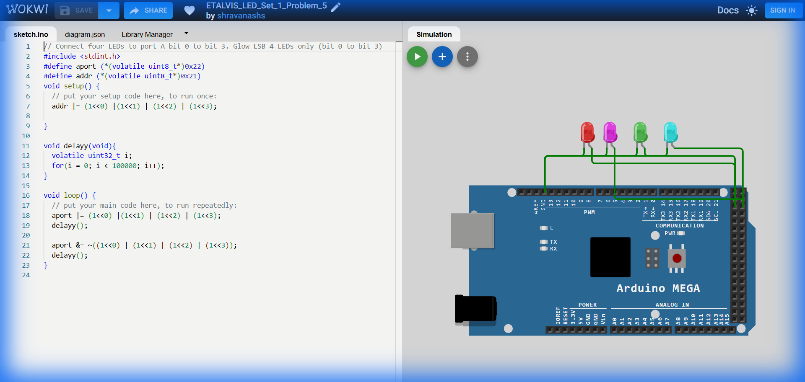

# Set 1 Problem 5: Lower Nibble Blink (Port A)

## Problem Statement
Connect four LEDs to the lower half of **Port A** (Bits 0, 1, 2, 3).
Blink all four of them together.

## Simple Explanation
A "Byte" (8 bits) can be split into two halves called "Nibbles" (4 bits each).
-   **Lower Nibble**: Bits 0, 1, 2, 3 (The right side).
-   **Upper Nibble**: Bits 4, 5, 6, 7 (The left side).
This problem lights up the entire Lower Nibble. Pattern: `00001111`.

## Hardware Setup
-   **Port A**: Address `0x22`.
-   **Registers**:
    -   `addr` (`0x21`): DDRA.
    -   `aport` (`0x22`): PORTA.

## Code Analysis

```c
#include <stdint.h>

#define aport (*(volatile uint8_t*)0x22) // Port A Data
#define addr (*(volatile uint8_t*)0x21)  // Port A Direction

void setup() {
  // Set bits 0, 1, 2, 3 as output.
  // Combines (1<<0) through (1<<3).
  // Resulting Binary: 00001111 (Hex 0x0F).
  addr |= (1<<0) | (1<<1) | (1<<2) | (1<<3);
}

void delayy(void){
  volatile uint32_t i;
  for(i = 0; i < 100000; i++);
}

void loop() {
  // Turn ON Lower Nibble
  aport |= (1<<0) | (1<<1) | (1<<2) | (1<<3);
  delayy();

  // Turn OFF Lower Nibble
  aport &= ~((1<<0) | (1<<1) | (1<<2) | (1<<3));
  delayy();
}
```

## What I Learnt
-   **Nibbles**: The concept of splitting a byte into 4-bit chunks.
-   **Register Addresses**: Port A starts at `0x21`/`0x22`, which is standard for ATmega2560.
-   **Verbose Bitmasks**: While `0x0F` is shorter, writing `(1<<0)|...|(1<<3)` makes it graphically clear which specific pins are being targeted.

## Visuals

[Click here to run the simulation on Wokwi](https://wokwi.com/projects/450287693884152833)
