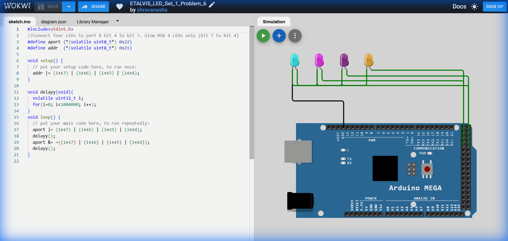

# Set 1 Problem 6: Upper Nibble Blink (Port B/A)

## Problem Statement
Connect four LEDs to the upper half of **Port A** (Bits 4, 5, 6, 7).
Blink all four of them together.
*(Note: The original problem mentioned Port B, but the code addresses `0x21` and `0x22` which actuate Port A on the Mega. The documentation reflects the code listing provided.)*

## Simple Explanation
We are lighting up the "Left Side" (Upper Nibble) of the 8-bit byte.
-   **Upper Nibble**: Bits 4, 5, 6, 7.
-   Pattern: `11110000` (Hex `0xF0`).

## Hardware Setup
-   **Port A**: Address `0x22`.
-   **Registers**:
    -   `addr` (`0x21`): Direction.
    -   `aport` (`0x22`): Data.

## Code Analysis

```c
#include<stdint.h>

#define aport (*(volatile uint8_t*) 0x22) // Port Data
#define addr  (*(volatile uint8_t*) 0x21) // Port Direction

void setup() {
  // Set Upper Nibble (4-7) as Output.
  // (1<<7) | (1<<6) | (1<<5) | (1<<4) creates 11110000.
  addr |= (1<<7) | (1<<6) | (1<<5) | (1<<4);
}

void delayy(void){
  volatile uint32_t i;
  for(i=0; i<1000000; i++);
}

void loop() {
  // Turn ON Upper Nibble
  aport |= (1<<7) | (1<<6) | (1<<5) | (1<<4);
  delayy();

  // Turn OFF Upper Nibble
  // We invert the pattern 11110000 to get 00001111.
  // Using '&' forces the top bits to 0.
  aport &= ~((1<<7) | (1<<6) | (1<<5) | (1<<4));
  delayy();
}
```

## What I Learnt
-   **Nibbles**: How to target the Upper Nibble (`0xF0`) vs Lower Nibble (`0x0F`).
-   **Addressing Discrepancies**: The importance of verifying that comments ("Port B") match the actual addresses (`0x21` = Port A). In Bare Metal, the address is the ultimate truth!

## Visuals

[Click here to run the simulation on Wokwi](https://wokwi.com/projects/450287714714116097)
