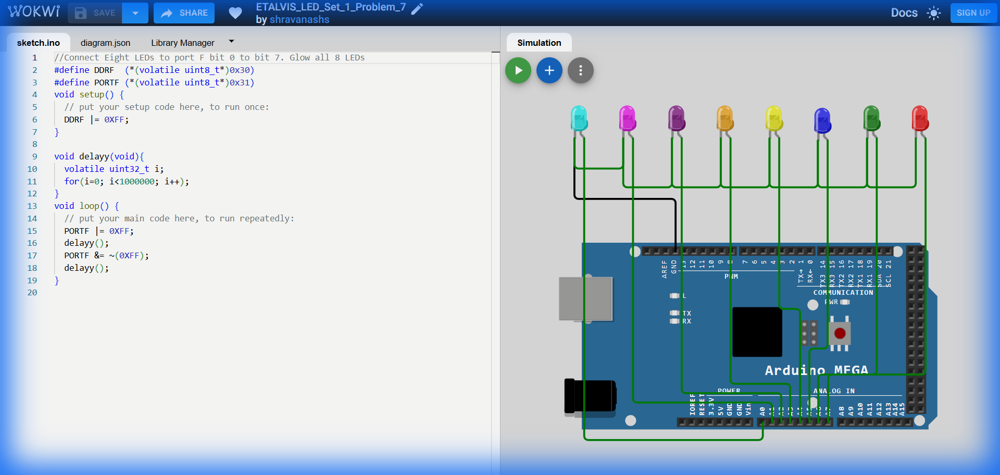

# Set 1 Problem 7: All LEDs Blink (Port F)

## Problem Statement
Connect eight LEDs to the entire **Port F** (Bits 0-7).
Blink all 8 LEDs together.

## Simple Explanation
We are using the entire "power strip". All 8 sockets are active.
-   Turn EVERYTHING ON (`11111111`).
-   Turn EVERYTHING OFF (`00000000`).

## Hardware Setup
-   **Port F**: Address `0x31`.
-   **Registers**:
    -   `DDRF` (`0x30`): Direction.
    -   `PORTF` (`0x31`): Data.

## Code Analysis

```c
//Connect Eight LEDs to port F bit 0 to bit 7. Glow all 8 LEDs
#define DDRF  (*(volatile uint8_t*)0x30)
#define PORTF (*(volatile uint8_t*)0x31)

void setup() {
  // Set all 8 bits to Output.
  // 0xFF is Hex for 255, which is 11111111 in Binary.
  DDRF |= 0xFF;
}

void delayy(void){
  volatile uint32_t i;
  for(i=0; i<1000000; i++);
}

void loop() {
  // Turn ON all LEDs
  PORTF |= 0xFF;
  delayy();

  // Turn OFF all LEDs
  // ~(0xFF) is 0x00 (00000000).
  PORTF &= ~(0xFF);
  delayy();
}
```

## What I Learnt
-   **Hexadecimal `0xFF`**: The shortcut for "All bits ones". This is the most common pattern in digital logic for selecting "everything".
-   **Port Width**: Understanding that ports on the ATmega are 8-bits wide.

## Visuals

[Click here to run the simulation on Wokwi](https://wokwi.com/projects/450287734852019201)
