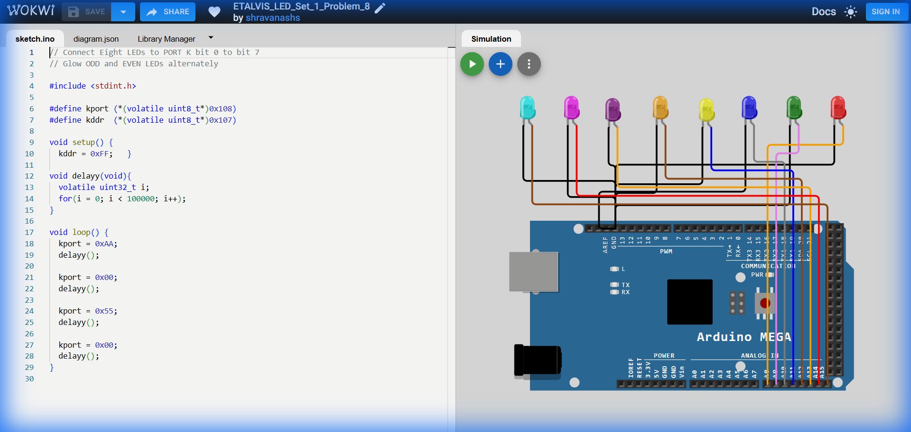

# Set 1 Problem 8: Odd/Even LED Blink

## Problem Statement
Imagine you have 8 light bulbs connected in a row. Your goal is to make them light up in an alternating pattern:
1.  First, turn on all the LEDs at odd positions (1st, 3rd, 5th, 7th).
2.  Wait for a short time.
3.  Then, turn on all the LEDs at even positions (2nd, 4th, 6th, 8th).
4.  Repeat this forever to create a blinking pattern.

## Simple Explanation
Computers and microcontrollers (like the Arduino Mega) use numbers to control things. To control 8 LEDs at once, we use a single byte (8 bits) of information.
-   Each bit can be `0` (OFF) or `1` (ON).
-   To turn on every other light, we need a pattern like `10101010` or `01010101`.
-   This problem uses these "binary patterns" to switch between two states: "Odd" and "Even".

## Hardware Setup
-   **Port Used**: Port K (An 8-pin connector on the Arduino Mega).
-   **Registers**:
    -   `DDRK` (Data Direction Register K): Controls whether pins are Inputs or Outputs.
    -   `PORTK` (Port K Data Register): Controls whether the pins are High (5V, LED ON) or Low (0V, LED OFF).

## Code Analysis

Here is the code broken down line-by-line:

```c
#include <stdint.h> // Includes standard integer types like uint8_t

// --- Register Definitions ---
// We create "pointers" to the specific memory addresses that control Port K.
// 'volatile' tells the compiler "don't optimize this, the value can change outside your control" (triggered by hardware).
#define kport (*(volatile uint8_t*)0x108) // Address of PORTK
#define kddr  (*(volatile uint8_t*)0x107) // Address of DDRK

void setup() {
  // Set all 8 pins of Port K to OUTPUT mode.
  // 0xFF in Hexadecimal is 11111111 in Binary.
  // 1 means Output, 0 means Input.
  kddr = 0xFF;   
}

// A simple delay function to pause the program so we can see the LEDs blink.
void delayy(void){
  volatile uint32_t i;
  for(i = 0; i < 100000; i++); // Empty loop that just counting up to waste time
}

void loop() {
  // Step 1: Turn on EVEN LEDs
  // 0xAA in Hex is 10101010 in Binary.
  // This turns on LEDs at index 7, 5, 3, 1 (depending on how you count, let's say these are the Even slots).
  kport = 0xAA;  
  delayy(); // Wait

  // Step 2: Turn OFF all LEDs
  // 0x00 is 00000000.
  kport = 0x00;  
  delayy(); // Wait

  // Step 3: Turn on ODD LEDs
  // 0x55 in Hex is 01010101 in Binary.
  // This turns on the other set of LEDs (index 6, 4, 2, 0).
  kport = 0x55;  
  delayy(); // Wait

  // Step 4: Turn OFF all LEDs again
  kport = 0x00;  
  delayy(); // Wait
}
```

## What I Learnt
-   **Hexadecimal Patterns**: `0xAA` (`10101010`) and `0x55` (`01010101`) are perfect opposites. They are standard patterns for checking alternating bits.
-   **Port Manipulation**: Instead of turning on 8 LEDs one by one with `digitalWrite`, we can do it all instantly by writing one number (`0xAA`) to the Port register.
-   **Volatile Keyword**: Essential for Bare Metal programming to ensure the compiler doesn't ignore our direct hardware access.

## Visuals

[Click here to run the simulation on Wokwi](https://wokwi.com/projects/450288060923527169)
