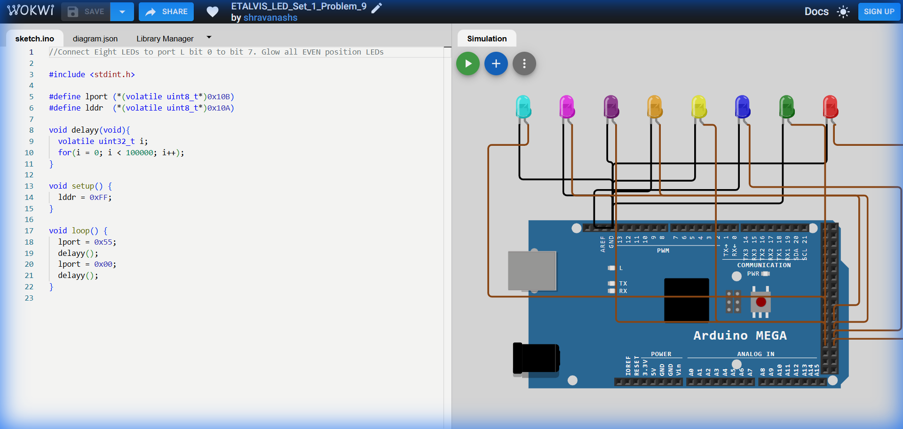

# Set 1 Problem 9: Even LED Blink (Port L)

## Problem Statement
Connect eight LEDs to **Port L**.
Blink only the **Even** position LEDs (Bits 0, 2, 4, 6).

## Simple Explanation
We want to light up every alternate socket starting from the first one.
-   Pattern: 1 (On), 0 (Off), 1 (On), 0 (Off), 1 (On), 0 (Off), 1 (On), 0 (Off).
-   Binary: `01010101` (Note: bit 0 is at the right end).

## Hardware Setup
-   **Port L**: Address `0x10B`.
-   **Registers**:
    -   `lddr` (`0x10A`): Direction.
    -   `lport` (`0x10B`): Data.

## Code Analysis

```c
#include <stdint.h>

#define lport (*(volatile uint8_t*)0x10B)
#define lddr  (*(volatile uint8_t*)0x10A)

void delayy(void){
  volatile uint32_t i;
  for(i = 0; i < 100000; i++);
}

void setup() {
  // Set all pins of Port L to Output mode.
  // Even though we only use the Even pins, setting 0xFF makes all 8 pins outputs.
  lddr = 0xFF;
}

void loop() {
  // Turn ON Even LEDs
  // 0x55 is the Hex code for 01010101.
  // This lights up bit 0, 2, 4, 6.
  lport = 0x55;
  delayy();

  // Turn OFF proper
  lport = 0x00;
  delayy();
}
```

## What I Learnt
-   **Magic Number `0x55`**: Memorizing that `0x55` (`01010101`) is the pattern for "Alternating bits starting with 1 at LSB".
-   **Efficient Port Writing**: We can set the complex pattern in a single instruction (`lport = 0x55`) rather than setting 4 different pins individually.

## Visuals

[Click here to run the simulation on Wokwi](https://wokwi.com/projects/450288081398026241)
