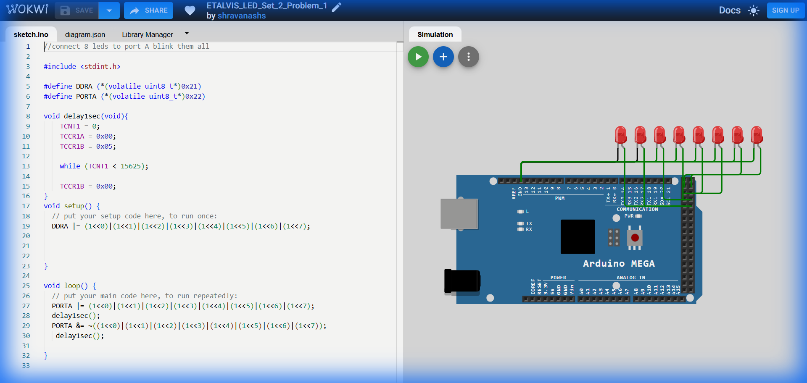

# Set 2 Problem 1: All LEDs Blink with Timer (Port A)

## Problem Statement
Connect 8 LEDs to **Port A** and make them ALL blink together.
The key difference from Set 1 is that we must use a **Hardware Timer** to create a precise 1-second delay, instead of just counting up in a loop.

## Simple Explanation
-   **Goal**: Flash all 8 lights on and off.
-   **Method**: Use an "Alarm Clock" inside the chip (Timer 1) to tell us exactly when 1 second has passed, ensuring our blinking speed is accurate.

## Hardware Setup
-   **Port A**: Address `0x22`.
-   **Registers**:
    -   `DDRA` (`0x21`): Direction.
    -   `PORTA` (`0x22`): Output.

## Code Analysis

```c
#include <stdint.h>

#define DDRA (*(volatile uint8_t*)0x21)
#define PORTA (*(volatile uint8_t*)0x22)

/* 
 * Precise Delay Function using Timer 1
 * 1. Reset the timer count (TCNT1) to 0.
 * 2. Set the speed (Prescaler) to 1024 (TCCR1B = 0x05).
 *    - CPU Speed = 16,000,000 Hz.
 *    - Timer Speed = 16,000,000 / 1024 = 15,625 Hz (Ticks per second).
 * 3. Wait until the counter reaches 15625 (which takes exactly 1 second).
 * 4. Stop the timer.
 */
void delay1sec(void){
    TCNT1 = 0;        
    TCCR1A = 0x00;    
    TCCR1B = 0x05;   

    while (TCNT1 < 15625); 

    TCCR1B = 0x00;   
}

void setup() {
  // Set all 8 bits of Port A to Output.
  // (1<<0) | ... | (1<<7) results in 11111111 (0xFF).
  DDRA |= (1<<0)|(1<<1)|(1<<2)|(1<<3)|(1<<4)|(1<<5)|(1<<6)|(1<<7);
}

void loop() {
  // Turn ON all LEDs
  PORTA |= (1<<0)|(1<<1)|(1<<2)|(1<<3)|(1<<4)|(1<<5)|(1<<6)|(1<<7);
  delay1sec();

  // Turn OFF all LEDs
  PORTA &= ~((1<<0)|(1<<1)|(1<<2)|(1<<3)|(1<<4)|(1<<5)|(1<<6)|(1<<7));
  delay1sec();
}
```

## What I Learnt
-   **Hardware Timers**: How `TCNT1` counts up automatically in the background.
-   **Prescalers**: Slowing down the super-fast CPU clock (16MHz) to a manageable speed for human-visible delays (15.6kHz).
-   **Math**: 16MHz / 1024 = 15625 ticks per second.

## Visuals

[Click here to run the simulation on Wokwi](https://wokwi.com/projects/450837212305922049)
