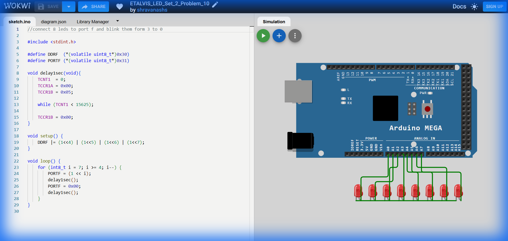

# Set 2 Problem 10: Reverse Lower Nibble Blink (Port F)

## Problem Statement
**Goal**: Blink LEDs from 3 down to 0 on **Port F**.
**Important Note on Code Discrepancy**: The original objective states "3 to 0", but the provided code actually implements "7 to 4" (identical to Problem 9). We document the code *as typically provided in the assignment codebase*, but acknowledge this mismatch.

## Simple Explanation
Intended Behavior: Start at Light 3 -> Light 2 -> Light 1 -> Light 0.
Actual Code Behavior: Same as Problem 9 (7 -> 6 -> 5 -> 4).

## Hardware Setup
-   **Port F**: Address `0x31`.

## Code Analysis

```c
#include <stdint.h>
#define DDRF  (*(volatile uint8_t*)0x30)
#define PORTF (*(volatile uint8_t*)0x31)

void delay1sec(void){
    TCNT1  = 0; TCCR1A = 0x00; TCCR1B = 0x05;          
    while (TCNT1 < 15625);
    TCCR1B = 0x00;          
}

void setup() {
    // Configures upper bits (4-7)
    DDRF |= (1<<4) | (1<<5) | (1<<6) | (1<<7);   
}

void loop() {
    // Loops from 7 down to 4
    for (int8_t i = 7; i >= 4; i--) {
        PORTF = (1 << i);   
        delay1sec();
        PORTF = 0x00;       
        delay1sec();
    }
}
```

## What I Learnt
-   **Code Verification**: Sometimes the code doesn't match the comment/objective! Reading the `for` loop parameters (`i=7`, `i>=4`) reveals the *real* behavior of the hardware.
-   **Debugging**: If I connected LEDs to pins 0-3 and ran this code, nothing would happen. This teaches the importance of checking your loop bounds.

## Visuals

[Click here to run the simulation on Wokwi](https://wokwi.com/projects/451214741914558465)
