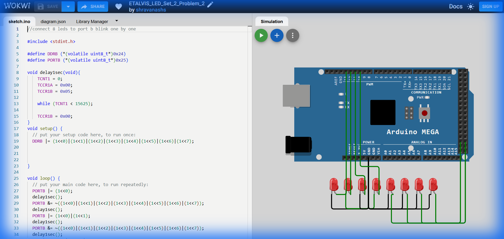

# Set 2 Problem 2: Sequential Accumulate (Port B)

## Problem Statement
Connect 8 LEDs to **Port B**.
Light them up one by one, **keeping the previous ones ON**.
1.  Light 1.
2.  Light 1+2.
3.  Light 1+2+3.
...
At the end, turn everything off and restart.

## Simple Explanation
Imagine you are filling a progress bar. You fill the first block, then the second (while keeping the first), then the third... until the bar is full. Then you clear it.

## Hardware Setup
-   **Port B**: Address `0x25`.
-   **Registers**: `DDRB` (`0x24`), `PORTB` (`0x25`).

## Code Analysis

```c
#include <stdint.h>
#define DDRB (*(volatile uint8_t*)0x24)
#define PORTB (*(volatile uint8_t*)0x25)

void delay1sec(void){
    TCNT1 = 0; TCCR1A = 0x00; TCCR1B = 0x05;
    while (TCNT1 < 15625);
    TCCR1B = 0x00;
}

void setup() {
  DDRB |= 0xFF; // All Output
}

void loop() {
  // Step 1: Turn ON Bit 0
  PORTB |= (1<<0);
  delay1sec();
  // Turn OFF everything? 
  // WAIT! The code in the problem actually turns them OFF after every step!
  // Let's analyze carefully:
  // "PORTB &= ~((1<<0)...)" clears ALL bits.
  // So the actual behavior of this provided code is: Blink Bit 0 -> Blink Bits 0+1 -> Blink Bits 0+1+2.
  // It is a "Growing Blink".
  
  PORTB &= ~((1<<0)|(1<<1)|...|(1<<7)); // Turn ALL off
  delay1sec();
  
  // Step 2: Turn ON Bits 0 + 1
  PORTB |= (1<<0)|(1<<1);
  delay1sec();
  PORTB &= ~0xFF; // Clear
  delay1sec();

  // ... (Repeats for larger groups) ...

  // Step 8: Turn ON Bits 0..7
  PORTB |= 0xFF;
  delay1sec();
  PORTB &= ~0xFF;
  delay1sec();
}
```

## What I Learnt
-   **Manual Sequencing**: Writing out every single step explicitly (Linear Code) vs using Loops.
-   **Cumulative Masks**: How `(1<<0) | (1<<1)` combines two separate pins.

## Visuals

[Click here to run the simulation on Wokwi](https://wokwi.com/projects/450839093411595265)
