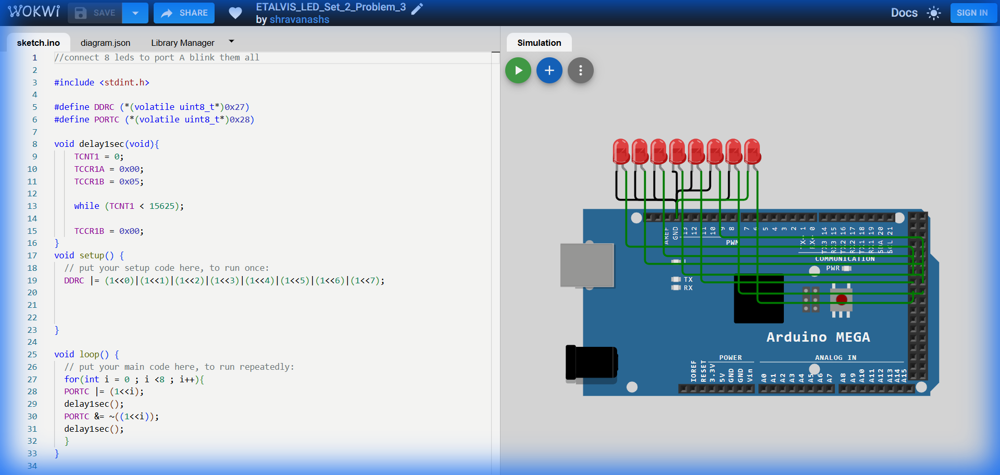

# Set 2 Problem 3: Sequential Single Blink (Port C)

## Problem Statement
Connect 8 LEDs to **Port C**.
Blink them one at a time in order: LED 0, then LED 1, then LED 2... up to LED 7.
Only ONE LED should be on at a time.

## Simple Explanation
This is the classic "Knight Rider" or "Scanner" effect (in one direction). The light moves from one end to the other.

## Hardware Setup
-   **Port C**: Address `0x28`.
-   **Registers**: `DDRC` (`0x27`), `PORTC` (`0x28`).

## Code Analysis

```c
#include <stdint.h>
#define DDRC (*(volatile uint8_t*)0x27)
#define PORTC (*(volatile uint8_t*)0x28)

void delay1sec(void){
    TCNT1 = 0; TCCR1A = 0x00; TCCR1B = 0x05;
    while (TCNT1 < 15625);
    TCCR1B = 0x00;
}

void setup() {
  // Set all pins to Output
  DDRC |= 0xFF;
}

void loop() {
  // Using a FOR Loop to automate the sequence
  for(int i = 0 ; i < 8 ; i++){
    
    // 1. Turn ON the current LED (i)
    // '|=' adds this light to whatever is there (though usually others are off)
    PORTC |= (1<<i);
    delay1sec();
    
    // 2. Turn OFF the current LED (i)
    // '&=' with '~' removes just this light.
    PORTC &= ~((1<<i));
    delay1sec();
  }
}
```

## What I Learnt
-   **Loops**: Using `for (i=0; i<8)` replaces writing 8 blocks of identical code.
-   **Variable Shift**: Using `(1 << i)` allows us to target a different pin dynamically in each iteration of the loop.

## Visuals

[Click here to run the simulation on Wokwi](https://wokwi.com/projects/450840620058693633)
