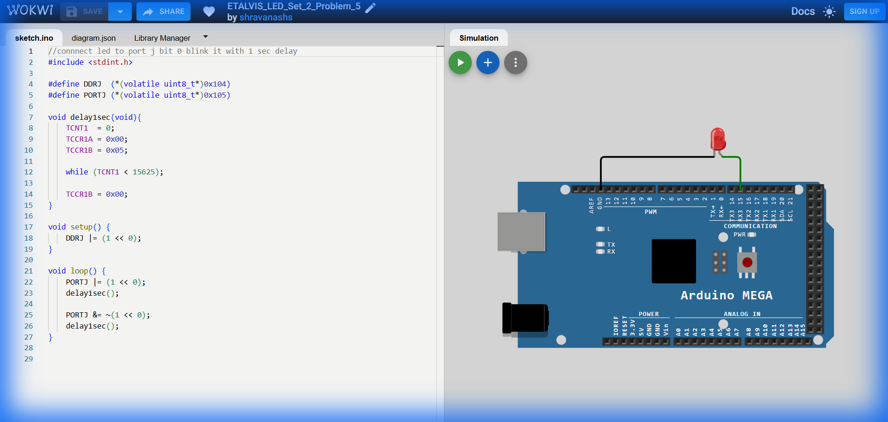

# Set 2 Problem 5: Single LED Timer Blink (Port J)

## Problem Statement
Connect a single LED to **Port J, Bit 0**.
Blink it with a precise 1-second delay using the Timer.

## Simple Explanation
This is identical to Set 1 Problem 1, but "Upgraded" to use the accurate Hardware Timer instead of a dummy loop.

## Hardware Setup
-   **Port J**: Address `0x105`.
-   **Bit**: 0.

## Code Analysis

```c
#include <stdint.h>
#define DDRJ  (*(volatile uint8_t*)0x104)
#define PORTJ (*(volatile uint8_t*)0x105)

void delay1sec(void){
    // Hardware Timer 1 Setup
    TCNT1  = 0;         // Reset Count
    TCCR1A = 0x00;
    TCCR1B = 0x05;      // Start (Prescaler 1024)

    while (TCNT1 < 15625); // Wait for 1 second

    TCCR1B = 0x00;      // Stop
}

void setup() {
    // Set only Bit 0 as Output
    DDRJ |= (1 << 0);   
}

void loop() {
    // Turn ON
    PORTJ |= (1 << 0);  
    delay1sec();

    // Turn OFF
    PORTJ &= ~(1 << 0); 
    delay1sec();
}
```

## What I Learnt
-   **Timer Reuse**: Once you write a good delay function (like `delay1sec` with Timer 1), you can reuse it everywhere to improve the quality of any blinking program.
-   **Single Bit Control**: Precision control of just one pin (`1<<0`) using Bitwise operators is the core skill of Bare Metal programming.

## Visuals

[Click here to run the simulation on Wokwi](https://wokwi.com/projects/451214789547181057)
