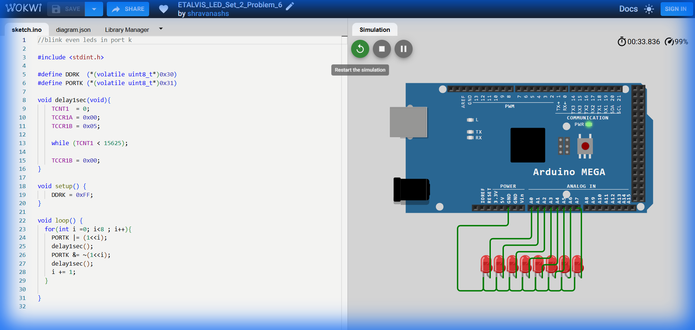

# Set 2 Problem 6: Even LED Blink Sequence

## Problem Statement
We have 8 LEDs connected to the Arduino. The goal is to walk through them one by one, but **skip every other LED**.
Specifically, we want to blink the LEDs at even positions (0, 2, 4, 6) individually:
1.  Turn ON LED 0 -> Wait -> Turn OFF -> Wait.
2.  Skip LED 1.
3.  Turn ON LED 2 -> Wait -> Turn OFF -> Wait.
4.  Skip LED 3... and so on.

## Simple Explanation
Imagine a staircase with 8 steps numbered 0 to 7. You want to climb the stairs, but you can only step on the **even** numbers (0, 2, 4, 6).
In programming, normally a loop goes 0, 1, 2, 3... To skip numbers, we need to change how we count. We can count by adding 2 each time instead of 1.

## Hardware Setup
-   **Port Used**: Port K.
-   **Key Concept**: **Bit Shifting**. To verify which LED to turn on, we use the math operation `1 << i`.
    -   If `i = 0`, `1 << 0` is `00000001` (First LED).
    -   If `i = 2`, `1 << 2` is `00000100` (Third LED).

## Code Analysis

```c
#include <stdint.h>

// Register Addresses for Port K
#define DDRK  (*(volatile uint8_t*)0x30) // Direction
#define PORTK (*(volatile uint8_t*)0x31) // Data

// --- Precise Delay Function ---
// This function uses a Hardware Timer (Timer 1) to wait exactly 1 second.
// This is much better than a simple 'for loop' counting because it is accurate regardless of CPU speed.
void delay1sec(void){
    TCNT1  = 0;         // Reset the timer counter to 0
    TCCR1A = 0x00;      // Normal mode
    TCCR1B = 0x05;      // Start timer with 1024 prescaler (slows down the clock)

    // Wait until the timer counts up to 15625.
    // Calculation: 16MHz CPU / 1024 / 15625 = 1Hz (1 second)
    while (TCNT1 < 15625);

    TCCR1B = 0x00;      // Stop the timer
}

void setup() {
    DDRK = 0xFF;        // Set all Port K pins to Output
}

void loop() {
  // The Loop: It starts at i=0 and goes up to 7.
  // Standard loop usually does i++ (increment by 1).
  for(int i = 0; i < 8 ; i++){
    
    // 1. Turn ON the i-th LED
    // We use the OR operator (|) to set the bit without affecting others.
    PORTK |= (1<<i);
    delay1sec();

    // 2. Turn OFF the i-th LED
    // We use AND (&) with NOT (~) to clear the bit.
    PORTK &= ~(1<<i);
    delay1sec();

    // 3. The Trick: Skip the next number
    // The 'for' loop will automatically do i++ (add 1) after this block finishes.
    // By adding ANOTHER 1 here, we get: i + 1 + 1 = i + 2.
    // So if i was 0, it becomes 1 here, then the loop makes it 2. We successfully skipped 1!
    i += 1; 
  }
}
```

## What I Learnt
-   **Step Loops**: How to modify a loop iterator inside the loop to create custom steps (like stepping by 2).
-   **Bit Shifting**: Using `(1 << i)` to pick a specific single LED from a group of 8.
-   **Hardware Timers**: Using specific hardware registers (`TCNT1`, `TCCR1B`) is a professional way to create accurate time delays, unlike "busy wait" loops that just waste CPU cycles.

## Visuals

[Click here to run the simulation on Wokwi](https://wokwi.com/projects/450851741143461889)
