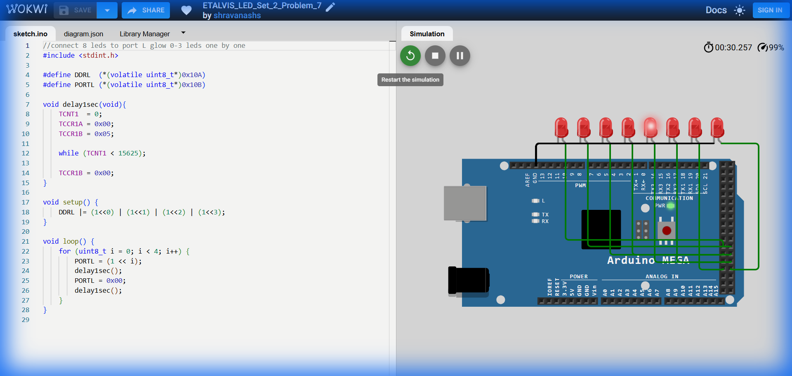

# Set 2 Problem 7: Lower Nibble Blink (Port L)

## Problem Statement
Connect 8 LEDs to **Port L**.
Blink the first four LEDs (0 to 3) one by one in order.
Ignore the rest (4 to 7).

## Simple Explanation
We are scanning through the "Lower Half" of the port.
1. Light 0 (Off).
2. Light 1 (Off).
3. Light 2 (Off).
4. Light 3 (Off).
Stop and Repeat.

## Hardware Setup
-   **Port L**: Address `0x10B`.
-   **Bits**: 0, 1, 2, 3.

## Code Analysis

```c
#include <stdint.h>
#define DDRL (*(volatile uint8_t*)0x10A)
#define PORTL (*(volatile uint8_t*)0x10B)

void delay1sec(void){
  TCNT1 = 0; TCCR1A = 0x00; TCCR1B = 0x05;
  while (TCNT1 < 15625);
  TCCR1B = 0x00;
}

void setup() {
  // Set Bits 0, 1, 2, 3 as Output.
  // (1<<0) | (1<<1) | (1<<2) | (1<<3) = 00001111 (0x0F)
  DDRL |= (1<<0) | (1<<1) | (1<<2) | (1<<3);
}

void loop() {
  // Loop from index 0 to 3
  for (uint8_t i = 0; i < 4; i++) {
    // Turn On
    PORTL = (1 << i);
    delay1sec();
    // Turn Off
    PORTL = 0x00;
    delay1sec();
  }
}
```

## What I Learnt
-   **Partial Scanning**: Restricting a loop `i < 4` allows us to animate just a specific section of the LED strip, leaving the others dark (or available for other tasks if we used `|=`).

## Visuals

[Click here to run the simulation on Wokwi](https://wokwi.com/projects/450854181787164673)
