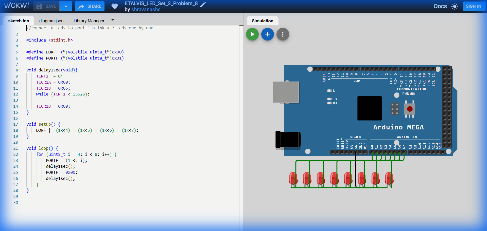

# Set 2 Problem 8: Upper Nibble Blink (Port F)

## Problem Statement
Connect 8 LEDs to **Port F**.
Blink the *last* four LEDs (4 to 7) one by one.
Bits 0-3 should be ignored.

## Simple Explanation
We are scanning through the "Upper Half" of the port.
Start at Light 4 -> Light 5 -> Light 6 -> Light 7.

## Hardware Setup
-   **Port F**: Address `0x31`.
-   **Bits**: 4, 5, 6, 7.

## Code Analysis

```c
#include <stdint.h>
#define DDRF  (*(volatile uint8_t*)0x30)
#define PORTF (*(volatile uint8_t*)0x31)

void delay1sec(void){
    TCNT1  = 0; TCCR1A = 0x00; TCCR1B = 0x05;          
    while (TCNT1 < 15625);
    TCCR1B = 0x00;          
}

void setup() {
    // Set Bits 4,5,6,7 to Output
    DDRF |= (1<<4) | (1<<5) | (1<<6) | (1<<7);   
}

void loop() {
    // Start loop at 4, go up to 7
    for (uint8_t i = 4; i < 8; i++) {
        PORTF = (1 << i);   
        delay1sec();
        PORTF = 0x00;       
        delay1sec();
    }
}
```

## What I Learnt
-   **Offset Loops**: Starting a loop at `i = 4` instead of 0 allow us to target the Upper Nibble directly without doing math like `1 << (i + 4)`.

## Visuals

[Click here to run the simulation on Wokwi](https://wokwi.com/projects/451214702764919809)
