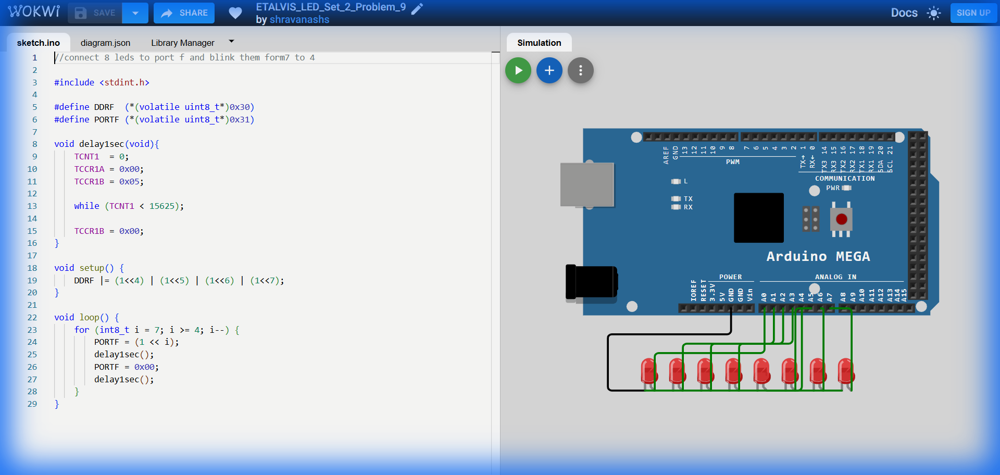

# Set 2 Problem 9: Reverse Upper Nibble Blink (Port F)

## Problem Statement
Connect 8 LEDs to **Port F**.
Blink the upper LEDs (7, 6, 5, 4) in **Reverse Order**.

## Simple Explanation
This is the same as Problem 8, but backwards.
Start at the highest light (7) and count down to the middle (4).

## Hardware Setup
-   **Port F**: Address `0x31`.

## Code Analysis

```c
#include <stdint.h>
#define DDRF  (*(volatile uint8_t*)0x30)
#define PORTF (*(volatile uint8_t*)0x31)

void delay1sec(void){
    TCNT1  = 0; TCCR1A = 0x00; TCCR1B = 0x05;          
    while (TCNT1 < 15625);
    TCCR1B = 0x00;          
}

void setup() {
    DDRF |= (1<<4) | (1<<5) | (1<<6) | (1<<7);   
}

void loop() {
    // Reverse Loop
    // Start at 7. Stop when less than 4. Decrement (i--)
    // Note: 'i' is signed (int8_t) to safely handle subtraction, though strictly 4 is > 0 so unsigned would work too.
    for (int8_t i = 7; i >= 4; i--) {
        PORTF = (1 << i);   
        delay1sec();
        PORTF = 0x00;       
        delay1sec();
    }
}
```

## What I Learnt
-   **Reverse Iteration**: Using `i--` implies counting down.
-   **Loop Boundaries**: Setting the condition `i >= 4` ensures we stop exactly after the 4th LED, not processing 3, 2, 1, 0.

## Visuals

[Click here to run the simulation on Wokwi](https://wokwi.com/projects/451214725256879105)
