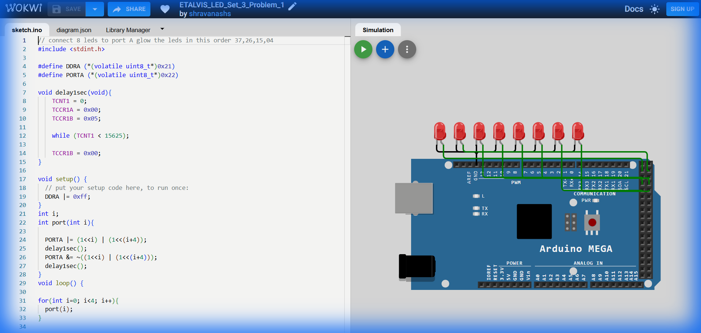

# Set 3 Problem 1: Parallel LED Pairs (Port A)

## Problem Statement
Connect 8 LEDs to **Port A**.
Light up **pairs** of LEDs simultaneously in a specific sequence:
1.  Light 0 and 4.
2.  Light 1 and 5.
3.  Light 2 and 6.
4.  Light 3 and 7.

## Simple Explanation
Imagine the LEDs are split into two groups of 4:
-   Group 1: 0, 1, 2, 3
-   Group 2: 4, 5, 6, 7
We turn on the FIRST light of Group 1 and the FIRST light of Group 2 together. Then the SECOND light of both groups... etc.

## Hardware Setup
-   **Port A**: Address `0x22`.

## Code Analysis

```c
#include <stdint.h>
#define DDRA (*(volatile uint8_t*)0x21)
#define PORTA (*(volatile uint8_t*)0x22)

void delay1sec(void){
    TCNT1 = 0; TCCR1A = 0x00; TCCR1B = 0x05;
    while (TCNT1 < 15625);
    TCCR1B = 0x00;
}

void setup() {
  DDRA |= 0xFF; // All Output
}

// Helper function to turn on the i-th and (i+4)-th LED
void port(int i){
  // Calculate the mask:
  // If i=0, (1<<0) is 00000001
  //        (1<<4) is 00010000
  // Combined (|): 00010001 (0x11)
  PORTA |= (1<<i) | (1<<(i+4));
  delay1sec();
  
  // Turn them OFF
  PORTA &= ~((1<<i) | (1<<(i+4)));
  delay1sec();
}

void loop() {
  // Loop 0 to 3
  for(int i=0; i<4; i++){
    port(i);
  }
}
```

## What I Learnt
-   **Parallel Logic**: How to control two physically separated pins (like 0 and 4) using a mathematical relationship (`i` and `i+4`).
-   **Functions**: Breaking code into a separate `port(i)` function makes the main `loop` much cleaner.

## Visuals

[Click here to run the simulation on Wokwi](https://wokwi.com/projects/451229712541347841)
