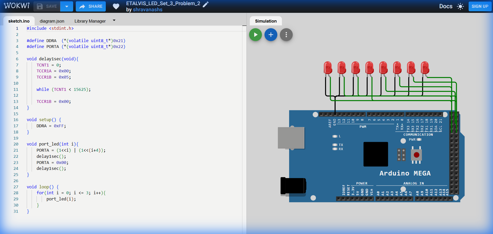

# Set 3 Problem 2: Parallel Pairs with Assignment (Port A)

## Problem Statement
Connect 8 LEDs to **Port A**.
Light up pairs: (0 & 4), (1 & 5), (2 & 6), (3 & 7).
**Difference from Problem 1**: In Problem 1, we used `|=` (OR) to add lights (though we cleared them after). Here, typically we use `=` (Assignment) to ensure only the specific pair is lit.

## Simple Explanation
Same as Problem 1. Two lights move in sync down the line.

## Hardware Setup
-   **Port A**: Address `0x22`.

## Code Analysis

```c
#include <stdint.h>
#define DDRA  (*(volatile uint8_t*)0x21)
#define PORTA (*(volatile uint8_t*)0x22)

void delay1sec(void){
    TCNT1 = 0; TCCR1A = 0x00; TCCR1B = 0x05;
    while (TCNT1 < 15625);
    TCCR1B = 0x00;
}

void setup() {
    DDRA = 0xFF;
}

void port_led(int i){
    // Using '=' sets the EXACT state.
    // If i=0, Pattern 00010001 is written.
    // Any other lights that might have been on would be forced OFF immediately.
    PORTA = (1<<i) | (1<<(i+4));
    delay1sec();
    
    // Clear All
    PORTA = 0x00;
    delay1sec();
}

void loop() {
    for(int i = 0; i <= 3; i++){
        port_led(i);
    }
}
```

## What I Learnt
-   **Consistency**: Using `=` (Assignment) is safer when you want to guarantee a "Frame" of animation where only specific things are on.

## Visuals

[Click here to run the simulation on Wokwi](https://wokwi.com/projects/451230358004944897)
