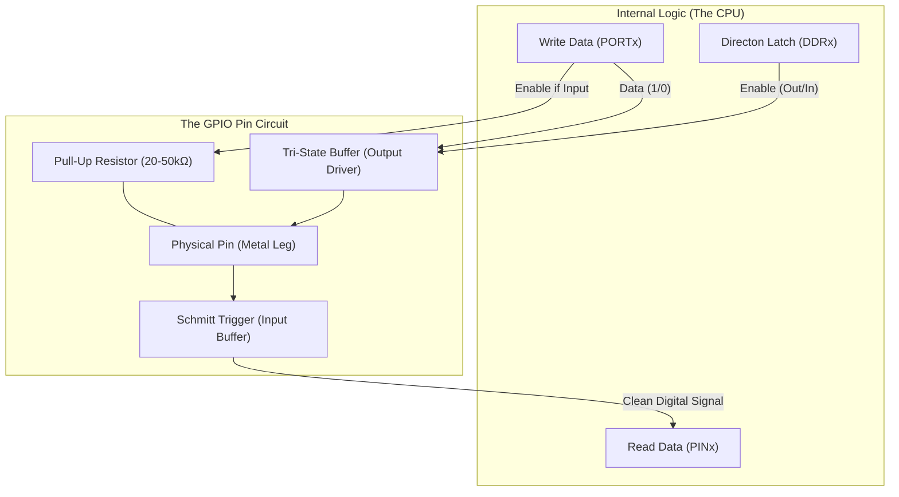

# Bare Metal Programming
*Learnings from Sets 1, 2, and 3*

This document serves as a comprehensive "Lecture Note" encompassing all the concepts mastered through the 30 LED programming assignments. It moves from the fundamental physics of the ATmega2560 pins to advanced software design patterns.

---

## Chapter 1: The Anatomy of a GPIO (Hardware Level)
A "Pin" on the microcontroller is not just a piece of metal. It is a complex circuit known as a **GPIO (General Purpose Input/Output)**.

### 1.1 The Internal Block Diagram
Every single pin (e.g., Port A Bit 0) has a circuit that looks roughly like this inside the silicon:



### 1.2 Key Components
1.  **Tri-State Buffer**: This is the gatekeeper.
    *   **State 1 (Output High)**: Connects the pin to 5V (Source Current).
    *   **State 2 (Output Low)**: Connects the pin to GND (Sink Current).
    *   **State 3 (High Impedance/Hi-Z)**: Disconnects the pin entirely. It "floats" electrically. This is the **Input** state.
2.  **Pull-Up Resistor (R_pu)**: A weak resistor (20kΩ - 50kΩ) connected to 5V.
    *   *Why?* If a pin is an Input and nothing is connected, it picks up static electricity (random 0s and 1s). The Pull-Up gently holds it at 5V (Logic 1) to keep it stable until a button shorts it to Ground (Logic 0).
3.  **Schmitt Trigger**: An input filter.
    *   It adds **Hysteresis** (~0.5V).
    *   *Without Hysteresis*: A noisy signal at 2.5V might flicker `101010`.
    *   *With Hysteresis*: The voltage must rise above **3.0V** (V_IH) to become a `1`, and drop below **1.5V** (V_IL) to become a `0`. This cleans up dirty signals.
4.  **Protection Diodes**: (Not shown in diagram but present) Clamping diodes connected to VCC and GND. They prevent voltages >5.5V or < -0.5V from frying the chip, but they can only handle very small currents!

---

## Chapter 2: The Register Trifecta
To control the circuit above, the CPU maps specific memory addresses to the control lines of that hardware.

### 2.1 DDRx (Data Direction Register) - The "Gatekeeper"
*   **Function**: Controls the **Tri-State Buffer**.
*   **Logic**:
    *   `0`: Buffer OFF (Input / High-Z). The pin listens.
    *   `1`: Buffer ON (Output). The pin drives voltage.
*   **Address Example**: `DDRA` is at `0x21`.

### 2.2 PORTx (Data Register) - The "Dual Personality"
This register does *two different things* depending on `DDRx`:
*   **If DDRx = 1 (Output)**:
    *   `PORTx = 1`: Drive 5V (High).
    *   `PORTx = 0`: Drive 0V (Low).
*   **If DDRx = 0 (Input)**:
    *   `PORTx = 1`: **Enable Pull-Up Resistor**. (Pin reads 1 by default).
    *   `PORTx = 0`: **Tri-State (Floating)**. (Pin reads random noise if unconnected).

### 2.3 PINx (Input Pins Address) - The "Sensor"
*   **Function**: Reads the digital value *after* the Schmitt Trigger.
*   **ReadOnly**: Usually, you only read this.
*   **Latency**: Due to synchronization latches (to match the 16MHz CPU clock), reading a pin takes 1-1.5 clock cycles.
*   **Secret Feature**: Writing a `1` to a bit in `PINx` will **TOGGLE** the corresponding bit in `PORTx`. (Hardware XOR feature).

---

## Chapter 3: Advanced C Implementation

### 3.1 Pointers and `volatile`
We defined our registers like this:
```c
#define PORTA (*(volatile uint8_t*)0x22)
```
*   `(uint8_t*)0x22`: "The number 0x22 is actually an address in memory."
*   `volatile`: "Warning! This value can change outside the program (e.g., by a button press or hardware interrupt). Do NOT optimize reads/writes to it."
    *   *Example*: Without `volatile`, the loop `while(PINA == 0);` might be optimized to `while(true);` if the compiler thinks PINA never changes. `volatile` forces it to check the electrical voltage every single time.

### 3.2 Read-Modify-Write (RMW)
When we do `PORTA |= (1<<2)`, the CPU actually does three steps:
1.  **Read** the current byte from 0x22.
2.  **Modify** it (OR with 00000100).
3.  **Write** it back.
*   *Safety*: This ensures we don't mess up the other 7 pins while changing Bit 2.
*   *Performance*: This is slightly slower than `PORTA = 0xFF` (Assignment), which is a single Write operation.

### 3.3 The "Step" Loop Pattern
Reviewing Set 2, Problem 6 (Odd/Even blink) taught us loop mechanics.
```c
// Standard Loop
for (int i=0; i<8; i++)

// Step Loop (Even Numbers)
for (int i=0; i<8; i+=2)

// Reverse Loop (Be careful with unsigned!)
// BAD: for (uint8_t i=7; i>=0; i--) -> i becomes 255 after 0 -> Infinite loop
// GOOD: for (int8_t i=7; i>=0; i--)
```

### 3.4 Lookup Tables (Data-Driven Design)
In Set 3, Problem 4, we saw chaotic blinking patterns.
Instead of writing 20 lines of `if/else`, we used an **Array**:
```c
uint8_t pattern[] = {0x01, 0xFF, 0x01, 0x3C};
PORTA = pattern[i];
```
This separates **Logic** (the `for` loop) from **Configuration** (the Array). In professional firmware, this data might actulaly live in EEPROM or Flash, allowing the device's behavior to change without recompiling code.

---

## Chapter 4: Timing (The Heartbeat)
### 4.1 Blocking vs Non-Blocking
*   `for(i=0; i<100000; i++);`: A "Software Delay". It relies on the CPU executing NOPs (No Operation). It freezes the entire chip.
*   **Hardware Timer**: A separate module that counts clock ticks.
    *   **TCNT1**: The counter (0 to 65535).
    *   **Prescaler (/1024)**: Slows the 16MHz clock to ~15kHz.
    *   **Validation**: Waiting for `TCNT1 == 15625` guarantees exactly 1.0 seconds.

---

## Summary Cheat Sheet
| Register | R/W | Purpose |
| :--- | :--- | :--- |
| **DDRn** | R/W | Direction (0=In, 1=Out) |
| **PORTn** | R/W | Output Data (if DDR=1) / Pull-Up (if DDR=0) |
| **PINn** | R/W* | Read Input / *Write 1 to Toggle Output |
| **TCNT1**| R/W | 16-bit Timer Counter Value |
| **TCCR1B**| R/W | Timer Control (Prescaler settings) |

*"Write 1 to Toggle" is a special feature of modern AVR chips.*
